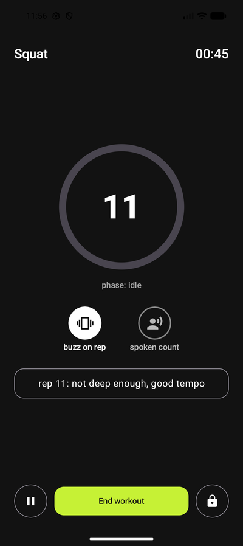
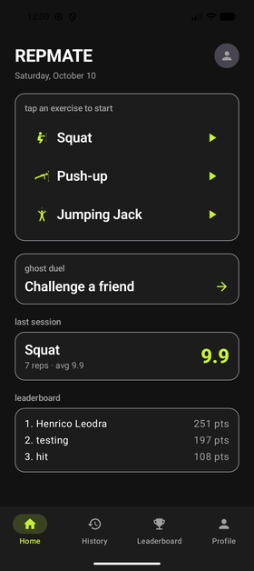
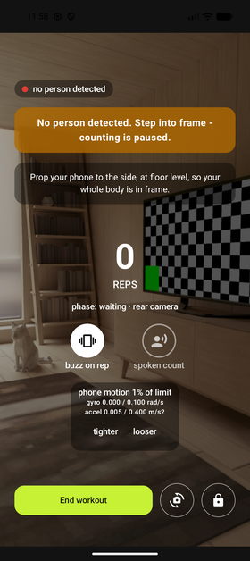
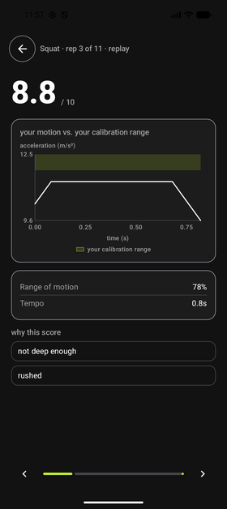
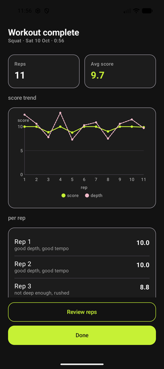
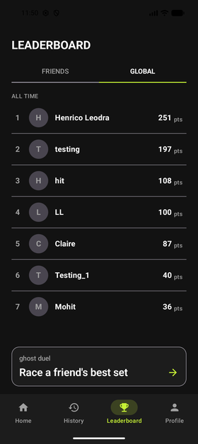
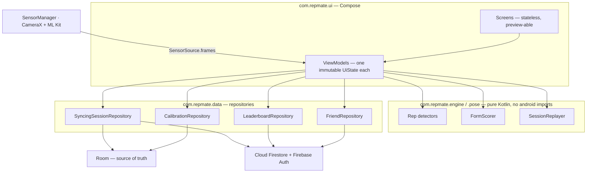
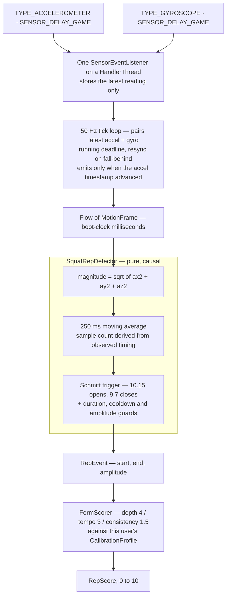

# RepMate

On-device motion sensing for repetition counting and form scoring, with per-user calibration, deterministic replay, cloud sync and social comparison. Built for COMP90018 Mobile Computing Systems Programming at the University of Melbourne.

[](https://github.com/qichongchen/RepMate-COMP90018/actions/workflows/android-ci.yml)


<p align="center">
  
</p>

## What it does

Training alone means nobody tells you your form is drifting. RepMate counts repetitions and grades each one from the phone's own accelerometer and gyroscope — no wearable, no subscription, no network round trip anywhere in the counting path — and for push-ups uses the front camera with on-device pose estimation instead.

The part that is not trivial is that none of the thresholds involved are universal. Across the four recorded squat sets in this repository, the same exercise performed correctly produces per-repetition amplitudes spanning **7.1×** between participants ([`CalibrationProfile.kt`](app/src/main/java/com/repmate/engine/CalibrationProfile.kt)), so the app measures each user against a short calibration set of their own rather than against a global constant. Every threshold in the engine is derived from recorded data and documented with the specific false positive it rejects, and every recording in the corpus is a regression test.

## Demo

> **[FILL: YouTube link to the demo video]**

| | | |
|---|---|---|
| <br/>**Home** — exercise picker, last session, live global top three | <br/>**Live Workout** — rep count, the reason for the last rep's score, feedback toggles | <br/>**Push-up Workout** — camera preview with the person gate holding the count, and the live phone-motion readout |
| <br/>**Motion Replay** — this rep's smoothed curve falling short of the calibration band | <br/>**Session Detail** — score and depth per rep across the set | <br/>**Leaderboard** — global tab, live from Firestore |

> **How these were captured, stated plainly.** All six come from the `Pixel_10a` AVD at 1080×2400, downscaled to 280 px. The app, the engine and the leaderboard data are real, but the squat reps were produced by driving the emulator's accelerometer through the console (`adb emu sensor set acceleration`) rather than by a person squatting. That is why the Motion Replay curve is a clean trapezoid instead of the rounded shape a real rep produces, and why the push-up screen shows the "no person detected" gate against the emulator's virtual scene rather than a counted rep.
>
> **Re-shoot these on a physical device before submitting.** The gap matters most for Motion Replay, which is the one screen whose whole point is the shape of a real signal.

Two screens are not in the grid because the emulator cannot produce them: **Ghost Duel** needs a friend who has published a best score, and the **friends leaderboard** needs the same. Both show their empty state here, and [`ghost-duel.png`](docs/screenshots/ghost-duel.png) is committed for reference. [`history.png`](docs/screenshots/history.png) is committed too — it shows a zero-rep session rendering as "–" rather than a bold 0.0.

## Features

Each line names the class or screen that implements it, so every claim can be checked against one file.

**Rep counting — inertial**

- Squats from acceleration magnitude, via a Schmitt-trigger state machine with five documented guards — [`SquatRepDetector`](app/src/main/java/com/repmate/engine/RepDetector.kt)
- Jumping jacks by pairing two acceleration bursts per repetition at a fixed target cadence of `TARGET_BPM = 52` — [`JumpingJackRepDetector`](app/src/main/java/com/repmate/engine/JumpingJackRepDetector.kt), [`BurstDetector`](app/src/main/java/com/repmate/engine/BurstDetector.kt)
- An audible beat generated at that same constant, so the audio, the on-screen pulse and the detector cannot drift apart — [`JumpingJackMetronome`](app/src/main/java/com/repmate/ui/audio/JumpingJackMetronome.kt)

**Rep counting — camera**

- Push-ups from elbow angle, using CameraX plus ML Kit on-device pose detection in `STREAM_MODE`, with an up/down hysteresis pair of 152.6°/126.5° and a 3-sample median filter — [`PushupPoseAnalyzer`](app/src/main/java/com/repmate/ui/workout/pushup/PushupPoseAnalyzer.kt), [`PushupRepDetector`](app/src/main/java/com/repmate/engine/PushupRepDetector.kt)
- One arm is chosen once per set from median depth and then held, because re-picking the nearer arm every frame switched **70 times in 60 seconds** on a real recording — [`ArmLock`](app/src/main/java/com/repmate/pose/ArmLock.kt)
- Counting is suspended, with an on-screen reason, when the phone is moving or no person is tracked — [`PhoneStabilityGate`](app/src/main/java/com/repmate/sensors/PhoneStabilityGate.kt), [`CountingGate`](app/src/main/java/com/repmate/pose/CountingGate.kt)

**Form scoring**

- A 0–10 score per repetition from depth, tempo and consistency, weighted 4 / 3 / 1.5 — [`FormScorer`](app/src/main/java/com/repmate/engine/FormScorer.kt)
- Scored against the user's own calibration set, not a global standard. Depth and consistency are **not scored at all** for an uncalibrated user rather than scored against a placeholder — [`CalibrationProfile`](app/src/main/java/com/repmate/engine/CalibrationProfile.kt), [`CalibrationScreen`](app/src/main/java/com/repmate/ui/calibration/CalibrationScreen.kt)

**Replay**

- A finished session's raw frames are re-run through the same detector and scorer to recover each repetition's time window and smoothed-motion curve, neither of which the stored scores carry — [`SessionReplayer`](app/src/main/java/com/repmate/engine/SessionReplayer.kt), [`MotionReplayScreen`](app/src/main/java/com/repmate/ui/motionreplay/MotionReplayScreen.kt)

**Feedback**

- A haptic buzz and the spoken rep count per repetition, each independently toggleable on the Profile screen — [`RepFeedback`](app/src/main/java/com/repmate/ui/workout/RepFeedback.kt), [`FeedbackToggles`](app/src/main/java/com/repmate/ui/workout/FeedbackToggles.kt)

**Social**

- Global and friends leaderboards over one shared points rule: best session per exercise, average rep score × rep count, summed across exercises — [`LeaderboardPoints`](app/src/main/java/com/repmate/data/repo/LeaderboardPoints.kt), [`LeaderboardScreen`](app/src/main/java/com/repmate/ui/leaderboard/LeaderboardScreen.kt)
- Friend requests, accept and remove, with the reverse friend-list entry written by the accepting side — [`FriendsScreen`](app/src/main/java/com/repmate/ui/friends/FriendsScreen.kt), [`FirestoreFriendRepository`](app/src/main/java/com/repmate/data/cloud/FirestoreFriendRepository.kt)
- Ghost duels: your best session for an exercise against a friend's published best — [`GhostDuelScreen`](app/src/main/java/com/repmate/ui/ghostduel/GhostDuelScreen.kt), [`FirestoreGhostScoreDataSource`](app/src/main/java/com/repmate/data/cloud/FirestoreGhostScoreDataSource.kt)
- Unique, case-insensitive display names, enforced in the security rules rather than in the client — [`ChooseDisplayNameScreen`](app/src/main/java/com/repmate/ui/displayname/ChooseDisplayNameScreen.kt), [`firestore.rules`](firestore.rules)

**Safety**

- An optional post-workout check-in: a notification after a delay, then an SMS to a nominated contact with a last-known-location link if it is not acknowledged. Both stages are WorkManager jobs so they survive the app being closed, and the acknowledgement flag is re-checked at send time — [`CheckInScheduler`](app/src/main/java/com/repmate/safety/CheckInScheduler.kt), [`CheckInNotifyWorker`](app/src/main/java/com/repmate/safety/CheckInNotifyWorker.kt), [`CheckInEscalateWorker`](app/src/main/java/com/repmate/safety/CheckInEscalateWorker.kt)

**Accounts**

- Email/password, Google Sign-In and guest (anonymous) sessions. A guest's local history is merged into the account they later sign in to — upload, then re-own, then forget — from the local Room copy — [`GuestHistoryMigrator`](app/src/main/java/com/repmate/data/sync/GuestHistoryMigrator.kt), [`AuthViewModel`](app/src/main/java/com/repmate/ui/auth/AuthViewModel.kt)

## Architecture



It is **one Gradle module**, layered by package rather than by Gradle project. The boundary that is actually enforced is the engine's: `com.repmate.engine` and `com.repmate.pose` import nothing from `android.*`, which is what lets 426 tests run on the JVM with no emulator. The ViewModel/repository split is a convention, not a compiler-enforced one.

| Package | Role |
|---|---|
| `com.repmate.engine` | Rep detectors, form scorer, calibration profile, replayer, trace loader. Pure Kotlin. |
| `com.repmate.pose` | Arm selection, counting gate, elbow geometry for the camera path. Pure Kotlin, no ML Kit types. |
| `com.repmate.sensors` | `SensorSource` and the phone-stability gate — the only place `SensorManager` is touched. |
| `com.repmate.data.local` | Room entities, DAOs, the guest session store. |
| `com.repmate.data.cloud` | Firestore and Firebase Auth data sources. |
| `com.repmate.data.repo` | Repository interfaces and the domain rules shared across them. |
| `com.repmate.data.sync` | Room↔Firestore reconciliation, guest history migration, leaderboard and best-score publishing. |
| `com.repmate.safety` | Post-workout check-in: scheduler, two WorkManager workers, SMS and location wrappers. |
| `com.repmate.ui.*` | One package per screen: screen, ViewModel, UI models. |
| `com.repmate.di` | Hilt modules. |
| `com.example.repmate` | Legacy namespace — `MainActivity`, the Room database class, the auth repository. See [Known limitations](#known-limitations). |

State flows one way: a ViewModel exposes a single immutable UI state, screens are stateless functions of it, and the engine is called from the ViewModel rather than from a composable.

## How the sensing works



Source: [`SensorSource.kt`](app/src/main/java/com/repmate/sensors/SensorSource.kt), [`RepDetector.kt`](app/src/main/java/com/repmate/engine/RepDetector.kt), [`FormScorer.kt`](app/src/main/java/com/repmate/engine/FormScorer.kt).

### Gravity is kept, deliberately

The app registers `TYPE_ACCELEROMETER`, which reports total acceleration including the ~9.81 m/s² of gravity — not `TYPE_LINEAR_ACCELERATION`. Detection runs on the magnitude `sqrt(ax² + ay² + az²)`, which is rotation-invariant and so reads the same whatever angle the phone sits at in a pocket. With gravity retained, a still phone parks that magnitude at a known constant and every real movement pushes it away from that resting value, so the thresholds can be absolute levels around a fixed baseline. Strip gravity out and the resting value becomes ~0, every tuned threshold is wrong by 9.81, and the recorded traces — which are also total acceleration — stop matching live data. That interchangeability between live and replayed frames is the whole reason the trace tests mean anything.

The cost is stated plainly in the detector's own documentation: magnitude discards **direction**, so the detector cannot tell the descent from the ascent. That single trade-off is what limits both the state machine and the form score, below.

### Fusion pairs the latest sample rather than aligning events

The accelerometer and the gyroscope are separate sensors delivering separate events at separate times, and no callback hands you both at once. Rather than attempt event alignment, both callbacks store only their latest reading and a separate tick loop pairs whatever is current into one `MotionFrame`. The documented cost is that the gyroscope value in a frame can be up to one sensor period stale relative to the accelerometer value — under 20 ms at `SENSOR_DELAY_GAME`, two orders of magnitude below the ~1 s timescale of a repetition.

Three details in that loop are not incidental:

- It keeps a **running deadline** rather than calling `delay(20)` in a loop, because the latter accumulates drift — each iteration would cost 20 ms *plus* whatever the work took.
- If it falls behind, the deadline is **resynced to now** rather than sprinting to catch up, because a burst of back-to-back frames is a worse lie than a missing one.
- A frame is emitted only when the accelerometer timestamp has **actually advanced**. `SENSOR_DELAY_GAME` is a hint, not a contract, and re-emitting one reading under a new timestamp would invent motion that never existed and flatten the very signal amplitude is measured from.

Timestamps come from `SensorEvent.timestamp` on the boot clock, never `System.currentTimeMillis()`: a wall clock can step backwards mid-workout from an NTP correction and hand a repetition a negative duration, breaking every tempo guard at once.

Hardware degrades rather than crashes. No gyroscope — common on budget devices — leaves the gyro channels at zero and everything else running, because rep detection is driven by the accelerometer alone. No accelerometer completes the stream empty, so the screen can say so.

### The filter window is a duration, and the bug that forced it

This is the most instructive thing in the codebase.

The moving-average filter was originally specified as **25 samples**. That is 250 ms only at 100 Hz. A moving average's cutoff frequency is set by its length *in time*, so a fixed sample count silently re-tuned the filter on every device — and with it every threshold in the detector, because all of them are measured on the filter's *output*. The same code was a 250 ms filter on a ~99 Hz Pixel and a **430 ms** filter on a ~58 Hz Samsung. Three separate "threshold hunts" turned out to be this one bug wearing different hats.

The window is now declared in milliseconds and the sample count is derived from observed frame timing at runtime: every frame evicts whatever has aged out of the trailing 250 ms. At ~99 Hz that is ~25 samples, at ~58 Hz ~15, at 50 Hz ~13 — different counts, the same quarter-second of signal, the same cutoff. Eviction works on the timestamps themselves rather than on an estimated rate, so it needs no warm-up and a rate that drifts or stalls *mid-set* is absorbed frame by frame. `smoothingSampleCount` and `observedSampleRateHz` are exposed so a stream running at an unexpected rate shows up in a log rather than surfacing later as an unexplained miscount.

Fixing it **cost** something, and the detector documents that too. At 430 ms of smoothing, the wobble in one trace ran 501 ms — comfortably under the 615 ms shortest genuine repetition — so `minRepDurationMs` rejected it on its own merits, independently of amplitude. The sharper 250 ms filter no longer rounds that wobble's shoulders off, so the same event now holds its window open for **743 ms**: *longer* than the shortest real repetition in the corpus. The two populations have crossed over on the duration axis, no value of `minRepDurationMs` separates them any more, and `minAmplitude` now carries that decision **alone**, on a band 0.15 m/s² wide. That is the engine's thinnest evidence, and it is written down as such rather than smoothed over.

### The rep detector, and why only two states are reachable

Two thresholds form a Schmitt trigger, so a signal hovering at one level cannot rattle the state back and forth:

```
IDLE ------------ smoothed > 10.15 ------------> DESCENDING   (rep window opens)
DESCENDING ------ smoothed <  9.70 ------------> IDLE         (window closes; emit if guards pass)
```

| Guard | Default | Why that number |
|---|---|---|
| `highThreshold` | 10.15 m/s² | Just above resting gravity: a squat clears it, a still pocket never does |
| `lowThreshold` | 9.7 m/s² | Below `highThreshold` — the hysteresis gap is what stops one wobbly rep counting as three |
| `minRepDurationMs` | 550 ms | 65 ms below the shortest real rep recorded (615 ms); 620 ms would already discard one |
| `maxRepDurationMs` | 3000 ms | Near twice the longest real rep (1573 ms) |
| `cooldownMs` | 500 ms | Headroom under the tightest genuine gap between reps in the fast set (917 ms) |
| `minAmplitude` | 0.94 m/s² | Centre of the 0.87–1.02 band: 0.11 above the largest non-rep, 0.09 below the softest genuine rep |
| `smoothingWindowMs` | 250 ms | The length every threshold above was measured against |

`maxRepDurationMs` exists for a failure that is not a mistuned threshold but a **stuck state machine**. A phone lying still reads ~9.81, which sits *between* the low and the high threshold, so a burst that ends with the phone parked opens a window nothing ever closes. On one trace that window ran **36.9 seconds** and was reported as one repetition. Note where the check sits: the window is abandoned **mid-flight**, the instant it passes the limit, not judged when it finally closes. Discarding it at close time would fix the miscount and leave the real defect, because throughout those 36.9 s the detector is stuck in `DESCENDING` and cannot start a repetition at all — a live user would be squatting into a counter that had gone deaf.

Only two of the five `RepPhase` values are reachable, and that is honesty rather than an unfinished state machine. Because magnitude is direction-blind, the detector genuinely cannot know whether the user is descending, paused at the bottom, or driving up, so reporting `BOTTOM` or `ASCENDING` would be a fabrication. `DESCENDING` is used to mean "a movement burst is in progress", named for the descent that opens it. Recovering the real phases needs the gyroscope or a gravity-vector estimate.

### Replay is deterministic

[`SessionReplayer`](app/src/main/java/com/repmate/engine/SessionReplayer.kt) re-runs a stored session's raw frames through the same detector and scorer used live, frame by frame, reading the smoothed magnitude after each call so it can capture a curve the detector does not store. It reproduces the original `RepEvent`s exactly because three properties hold together: the filter is **causal** and never looks at future samples, so it behaves identically live and in replay; the detectors are **pure** functions of the frame sequence, with no clock and no random source; and the same `CalibrationProfile` is applied. What would break it: making the filter non-causal, reading a wall clock inside a detector, or replaying under a different profile than the session was recorded with.

That same property is what makes the trace-backed tests meaningful. A recording either still produces its expected repetitions or it does not.

## Data model and security

Room is the source of truth. `SyncingSessionRepository.save()` writes locally first and treats the Firestore upload as best-effort, so a workout finishes with no network. Reconciliation is by idempotent recompute rather than by diffing: `LeaderboardSync` and `LocalBestScoreSync` recalculate from stored sessions, so republishing the same session twice is harmless.

| Collection | Holds | Who may read |
|---|---|---|
| `usernames/{name}` | A claim ticket: owner uid and `createdAt`. Document id is the display name, lowercased. | Any signed-in user may `get` one name; `list` denied |
| `users/{uid}` | `displayName`, `createdAt` | Any signed-in user may `get`; `list` denied |
| `users/{uid}/workoutSessions/{id}` | One finished session | Owner only |
| `users/{uid}/friends/{friendId}` | Friend-list entry | Owner only |
| `users/{uid}/friendRequests/{senderId}` | Pending incoming request | Recipient and sender |
| `users/{uid}/ghostScores/{exercise}` | Published best: `averageScore`, `repCount`, `startedAt` | Any signed-in user may `get`; `list` denied |
| `leaderboard/{uid}` | `displayName`, `points`, `updatedAt` | Any signed-in user |

[`firestore.rules`](firestore.rules) is 242 lines, covered by 68 emulator tests. The mechanisms worth reading:

- **Uniqueness by document-id collision.** `usernames/{name}` uses the lowercased display name as the document id and defines **no update rule at all**. A second claim on the same name is therefore a create on a document that already exists, which nothing allows. That is the entire uniqueness guarantee — no counter, no client-side check taken on trust.
- **`getAfter()` and `existsAfter()` force a batch.** Creating a name claim requires that `users/{uid}.displayName`, *as it will be once this write commits*, is valid and lowercases to exactly this document id. The claim and the profile update therefore have to land in the same batch or transaction; neither can be written alone. Releasing a name is the mirror image: a delete is allowed only if, after the write, the owner's display name no longer maps to that id. So a name can only be released by renaming, and a rename batch must delete the old claim rather than letting a user hoard names.
- **Field allow-lists on every writable document.** Each write rule pairs `hasAll([...])` with `hasOnly([...])`, so a client can neither omit a required field nor smuggle an extra one in.
- **Bounded values.** A leaderboard row's `points` must be an `int` in `[0, 100000]` and its `updatedAt` must equal `request.time`; a ghost score's `averageScore` must be a number in `[0, 10]` and its `repCount` a positive `int`; `exercise` must be one of three literals *and* match the document id it is stored under. A client cannot write itself to the top of the board with a bogus value, or backdate a row.
- **`allow list: if false`** on usernames, user profiles and ghost scores. Single-document reads are what the features need; enumeration is not, so it is denied rather than left to chance.
- **Guests are second-class on purpose.** `isRealAccount()` rejects anonymous sign-in providers, so a guest cannot claim a display name — which is why guest history is merged from the local Room copy on sign-in rather than written under a guest uid in the cloud.
- **ASCII-only display names, checked on the original text** rather than only on the id. If `lower()` were Unicode-aware, a look-alike such as the Kelvin sign (U+212A, whose lowercase is ASCII "k") could map to an id someone else owns. The emulator's `lower()` is ASCII-only, so this is defence in depth: it costs nothing and does not depend on that behaviour.

## Getting started

### Prerequisites

| | |
|---|---|
| JDK | **17** — `sourceCompatibility` and `targetCompatibility` are both `VERSION_17` |
| Gradle | 9.5.0, supplied by the wrapper. Do not install it separately |
| Android Gradle Plugin | 9.3.2 |
| Kotlin | 2.2.10 |
| Android SDK Platform | **37** (`compileSdk` and `targetSdk`) |
| Device or emulator | API 26 or higher (`minSdk 26`) with an accelerometer. A gyroscope and a front camera are needed for jumping jacks and push-ups respectively |
| Node.js | 20, for the Firestore rules tests only |
| JDK for the Firebase emulator | **21** — the emulator needs a newer JDK than the Android build. See `.github/workflows/android-ci.yml`, which installs both |
| Android Studio | **[FILL: the version the team builds with]**. Command-line builds need only the JDK and the SDK |

### Two files the build needs

**`app/google-services.json`** is committed, so Firebase works out of the box for this project.

**`local.properties`** is not committed and the build **hard-fails without it**:

```properties
GOOGLE_WEB_CLIENT_ID=<OAuth Web Client ID, client_type 3, from app/google-services.json>
```

`app/build.gradle.kts` calls `error(...)` when that key is missing or empty — by design, not by accident. Google Sign-In otherwise fails at runtime with an opaque message, so the build refuses instead. Copy the `client_id` whose `client_type` is `3` out of `app/google-services.json`.

The instrumented Firestore tests additionally read `TEST_ACCOUNT_A_EMAIL`, `TEST_ACCOUNT_A_PASSWORD`, `TEST_ACCOUNT_B_EMAIL`, `TEST_ACCOUNT_B_PASSWORD` and `TEST_ACCOUNT_B_UID` from the same file. These default to empty strings, so the build and every other test suite work without them.

### Build and run

```bash
./gradlew assembleDebug                      # debug APK
./gradlew installDebug                       # build and install on the attached device
```

### Tests

```bash
./gradlew testDebugUnitTest                  # 426 JVM tests, no device needed
./gradlew compileDebugAndroidTestKotlin      # type-check the instrumented suite without a device
./gradlew connectedDebugAndroidTest          # 47 instrumented tests, needs a device or AVD
```

Firestore security rules, which run against the emulator rather than the real project:

```bash
npm ci
npx firebase emulators:exec --only firestore "node --test tests/firestore.rules.test.cjs"
```

`emulators:exec` starts the emulator, runs the command and shuts it down, so there is nothing to clean up afterwards. Ports are in [`firebase.json`](firebase.json): Firestore on `127.0.0.1:8080`, Auth on `127.0.0.1:9099`. If 8080 is already held by another process that command fails with a port-in-use error rather than silently testing the production project.

### What CI runs

[`.github/workflows/android-ci.yml`](.github/workflows/android-ci.yml) runs on every push to `main` and every pull request against it: `assembleDebug`, `testDebugUnitTest`, `compileDebugAndroidTestKotlin`, then the rules tests under the emulator. The badge at the top of this file reflects that workflow.

The instrumented tests are compiled but not run, and the comment in the workflow says why: a production method was renamed, `androidTest` kept calling the old name, and because that source set never built in CI, **every instrumented test in the module was unrunnable for weeks before anyone noticed**. `assembleDebug` and `testDebugUnitTest` both pass straight through that. Running them needs a device plus two emulators, which the job cannot provide; compiling them catches the failure that actually happened.

## Testing

| Suite | Count | Runs on | Covers |
|---|---|---|---|
| JVM unit tests | **426** | JVM, no device | Engine, pose geometry, repositories, sync and migration, ViewModels, UI mappers |
| Firestore rules | **68** | Firestore emulator | Every rule in `firestore.rules`, allowed and denied paths both |
| Instrumented | **47** across 8 files | Device or AVD | Room DAOs and migrations, the guest session store, DataStore, the safety escalation worker, two Firestore data sources |

There are no `@Ignore`d tests and no skips in the JVM suite.

### Trace-backed engine tests

The engine's regression suite runs against **six real recordings** in [`app/src/test/resources/traces/`](app/src/test/resources/traces/) — four squat sets from three participants, and two jumping-jack sets — each paired with a `.expect` file stating what it should detect and in which time window.

Two things make this worth a look. First, [`TraceLibrary`](app/src/test/java/com/repmate/engine/TraceLibrary.kt) **auto-discovers** them: dropping `my_trace.csv` and `my_trace.expect` into that directory adds them to the suite with no code change, which matters because the only way to learn whether thresholds generalise is to make adding recordings cheap. A CSV with no companion `.expect` is a hard **error**, not a skip, so a recording nobody has written ground truth for cannot vanish from the suite silently. Second, the `.expect` file declares the recording's **units** and is parsed before the CSV, because an iOS export is in g and an Android one in m/s² and the two are indistinguishable from their headers alone.

The `.expect` files are not bare numbers. They carry the measured evidence behind each threshold — which repetition is the softest, what the largest non-repetition in the recording swings, and what those figures were before the filter was normalised. [`squat_10_hit.expect`](app/src/test/resources/traces/squat_10_hit.expect) is the one to read.

### What has not been run

**15 of the 47 instrumented tests target the Firestore and Auth emulators** rather than a plain device: `FirestoreFriendRepositoryTest` (8) and `FirestoreGhostScoreDataSourceTest` (7). The **8 friend tests have never been executed** — they need both emulators plus the five `TEST_ACCOUNT_*` values, and that combination has not yet been stood up. They compile in CI, which is all that is currently claimed for them.

> **[FILL: confirm which of the remaining instrumented tests have actually been run on a device, and say so here rather than leaving it implied]**

## Known limitations

1. **The amplitude floor rests on one participant.** `minAmplitude = 0.94` sits in a band 0.15 m/s² wide (0.87–1.02) and **both edges of that band come from a single recording**. Amplitude is also the most person-dependent quantity in the engine — the softest genuine repetition ranges 1.03 to 7.31 across the corpus — so a floor set by one soft-repping participant may not hold for a fourth person. Since the filter was normalised this guard also has no backup, because duration can no longer contribute to the wobble/repetition decision. This is the engine's single point of failure.
2. **`RepScore.pauseSeconds` is not implemented** and is always `0f`. `RepEvent` carries only the whole movement burst, and because magnitude is direction-blind there is no timestamp anywhere for "arrived at the bottom" to measure a dwell time from. It is an explicit placeholder, documented as one.
3. **Depth and consistency are not scored for uncalibrated users.** A deliberate choice over showing a number known to be unreliable, but it means an uncalibrated user's score rests on tempo alone.
4. **No conflict detection in cloud sync.** `FirestoreWorkoutDataSource` writes a session with `.set()` on a locally generated document id. Nothing compares timestamps or versions, so the last write to a given document wins. Sessions are immutable once finished, which is why this has not bitten us, but two devices writing the same user's data concurrently is not a case the design handles.
5. **R8 is disabled on release** — `optimization { enable = false }` in `app/build.gradle.kts`. The release APK is unminified and unobfuscated.
6. **Two namespaces coexist.** `com.repmate` is the real one; `com.example.repmate` still holds `MainActivity`, the Room database class and the auth repository, and `applicationId` is still `com.example.repmate`. Changing the application id would orphan installed builds, so it was left alone.
7. **`PhoneStabilityGate`'s thresholds are a first proposal, not measured values.** They come from typical sensor-noise figures, not from a recording of a phone propped beside someone doing push-ups — which is the number that matters, because floor vibration above those limits would pause counting during real repetitions. Debug builds show the live readings so this can be checked on a phone.
8. **`ArmLock` never re-validates its choice.** If the user moves after the lock, or the initial depth estimate was wrong, the arm stays wrong until the set is reset.
9. **Jumping-jack counting assumes the metronome.** The detector pairs two bursts per repetition at a fixed 52 BPM; an unpaced set is outside what it models.
10. **`SensorSource.frames` supports one collector at a time.** Two simultaneous collectors would share the single hardware registration, and the first to cancel would stop it for both. Making that safe needs `shareIn`.
11. **Only two of five `RepPhase` values are reachable** for squats, for the direction-blindness reason above.
12. **The ML Kit pose model is a beta release** (`18.0.0-beta5`). Google has never shipped the current pose model as stable; the one non-beta release is years older.
13. **Instrumented tests do not run in CI**, and 8 of them have never run anywhere. See [What has not been run](#what-has-not-been-run).

## Team

| Member | Built | GitHub |
|---|---|---|
| Mohit Nanda | Motion engine, sensor pipeline and calibration; the recorded trace corpus and its auto-discovering test harness; the push-up camera path and its gating; the safety check-in feature; leaderboard scoring | [@mohitnanda786](https://github.com/mohitnanda786) |
| Henrico Leodra | The presentation layer — navigation, theme, shared components and most screens; the authentication and display-name flows; guest history migration; haptic and spoken feedback | [@henricoleodra](https://github.com/henricoleodra) |
| Qichong Chen (Jasper) | Project foundations: the Gradle build, `MainActivity`, the Room database class and migrations; the Friends feature; the leaderboard read path; resources and build configuration | [@qichongchen](https://github.com/qichongchen) |
| Xiaonuo Jia (Lisa) | Persistence, cloud and security: the Room layer, all five Firestore data sources, the Room-first sync path, `firestore.rules` and its 68-test emulator suite; Firebase setup and CI | [@Lisa-Jia07](https://github.com/Lisa-Jia07) |
| Xue Li (Claire) | Form scoring — the depth, tempo and consistency rule and its calibration gating — and deterministic session replay, plus the Motion Replay presentation layer | [@Claire-59](https://github.com/Claire-59) |

Roles are derived from git: each line names what that member **created and then maintained**, recoverable with `git log main --diff-filter=A` under `.mailmap`. The report's §4 gives the same breakdown file by file.

Handles for Mohit and Henrico come from their GitHub noreply addresses in `.mailmap` and are exact. The other three are the names used in commit authorship — conventionally the GitHub username, but worth a glance before submission.

> **[FILL: student numbers, if the submission wants them here as well as in the report]**

## Acknowledgements

Generative AI tools were used during development. Every use is recorded in [`AI_USAGE_LOG.md`](AI_USAGE_LOG.md) with the date, team member, tool, purpose and how the output was used. That log is the authoritative record.

> **[FILL: confirm this README, `AI_USAGE_LOG.md` and the report's AI acknowledgement section say the same thing before submitting — a marker reads them together]**

Third-party components beyond the ordinary AndroidX and Firebase dependencies:

- **ML Kit Pose Detection** (Google, `18.0.0-beta5`) — on-device pose estimation for push-up counting. The model runs entirely on the device; no camera frame leaves the phone.
- **CameraX** (AndroidX, 1.6.2) — camera preview and the frame-analysis pipeline.
- **Firebase** (Auth, Cloud Firestore) — accounts and the social features.
- **Sensor Logger** — used to capture the recorded motion traces every engine threshold was derived from and is tested against.

The full dependency list, with the reason each one is present, is in [`gradle/libs.versions.toml`](gradle/libs.versions.toml) and [`app/build.gradle.kts`](app/build.gradle.kts).
