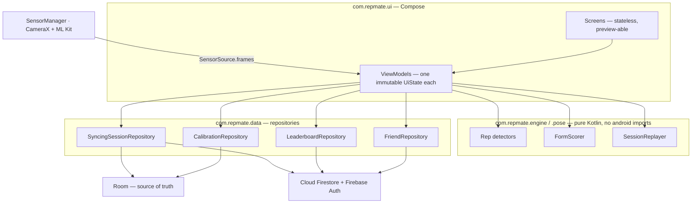

# RepMate

On-device motion sensing for repetition counting and form scoring, with per-user calibration, deterministic replay, cloud sync and social comparison. Built for COMP90018 Mobile Computing Systems Programming at the University of Melbourne.

[](https://github.com/qichongchen/RepMate-COMP90018/actions/workflows/android-ci.yml)


<p align="center">
  
</p>

> **Full engineering detail is in the submitted report**, [`report/REPORT.pdf`](report/REPORT.pdf). This README is the short tour; **Appendix D — Technical reference** carries the sensor pipeline, the threshold derivations, the replay-determinism argument and the security rules in full.

## What it does

Training alone means nobody tells you your form is drifting. RepMate counts repetitions and grades each one from the phone's own accelerometer and gyroscope — no wearable, no subscription, no network round trip in the counting path — and for push-ups uses the camera with on-device pose estimation instead.

The part that is not trivial is that none of the thresholds involved are universal. Across the four recorded squat sets in this repository, the softest correctly performed repetition varies by **7.1×** between participants ([`CalibrationProfile.kt`](app/src/main/java/com/repmate/engine/CalibrationProfile.kt)), so the app measures each user against a short calibration set of their own rather than against a global constant. Every threshold in the engine is derived from recorded data and documented with the specific false positive it rejects, and every recording in the corpus is a regression test.

## Demo

> **[FILL: YouTube link to the demo video]**

| | | |
|---|---|---|
| <br/>**Home** — exercise picker, last session, live global top three | <br/>**Live Workout** — rep count, the reason for the last rep's score, feedback toggles | <br/>**Push-up Workout** — camera preview with the person gate holding the count, and the live phone-motion readout |
| <br/>**Motion Replay** — this rep's smoothed curve falling short of the calibration band | <br/>**Session Detail** — score and depth per rep across the set | <br/>**Leaderboard** — global tab, live from Firestore |

> **How these were captured.** All six come from the `Pixel_10a` AVD at 1080×2400. The app, the engine and the leaderboard data are real, but the squat repetitions were produced by driving the emulator's accelerometer rather than by a person squatting — which is why the Motion Replay curve is a clean trapezoid rather than the rounded shape a real repetition produces. **Re-shoot on a physical device before submitting.**

**Ghost Duel** and the **friends leaderboard** need a friend who has published a best score, which an emulator cannot stage; their empty states are committed as [`ghost-duel.png`](docs/screenshots/ghost-duel.png).

## Features

Each claim names the class that implements it, so it is traceable to one file.

**Rep counting.** Squats from acceleration magnitude through a Schmitt trigger with five measured guards ([`SquatRepDetector`](app/src/main/java/com/repmate/engine/RepDetector.kt)). Jumping jacks by pairing **two** impacts per repetition at `TARGET_BPM = 52` ([`JumpingJackRepDetector`](app/src/main/java/com/repmate/engine/JumpingJackRepDetector.kt)); the metronome reads that same constant, so audio, the on-screen pulse and the detector cannot drift apart. Push-ups from elbow angle via CameraX and ML Kit pose, with a 152.6°/126.5° hysteresis pair and a 3-sample median filter ([`PushupRepDetector`](app/src/main/java/com/repmate/engine/PushupRepDetector.kt)). One arm is locked per set rather than re-picked per frame, which switched 70 times in 60 seconds on a real recording ([`ArmLock`](app/src/main/java/com/repmate/pose/ArmLock.kt)); counting suspends with an on-screen reason when the phone moves or nobody is tracked ([`PhoneStabilityGate`](app/src/main/java/com/repmate/sensors/PhoneStabilityGate.kt), [`CountingGate`](app/src/main/java/com/repmate/pose/CountingGate.kt)).

**Scoring and replay.** A 0–10 score per repetition from depth, tempo and consistency, weighted 4 / 3 / 1.5 against the user's own calibration ([`FormScorer`](app/src/main/java/com/repmate/engine/FormScorer.kt)); depth and consistency are **not scored at all** for an uncalibrated user rather than scored against a placeholder. A finished session's raw frames re-run through the same detector and scorer to recover each repetition's time window and motion curve ([`SessionReplayer`](app/src/main/java/com/repmate/engine/SessionReplayer.kt)). Per-rep haptic buzz and spoken count, independently toggleable ([`RepFeedback`](app/src/main/java/com/repmate/ui/workout/RepFeedback.kt)).

**Social and safety.** Global and friends leaderboards over one points rule — best session per exercise, average rep score × rep count, summed ([`LeaderboardPoints`](app/src/main/java/com/repmate/data/repo/LeaderboardPoints.kt)). Friend requests, ghost duels against a friend's published best, and unique case-insensitive display names enforced in [`firestore.rules`](firestore.rules) rather than in the client. An optional post-workout check-in sends a notification, then an SMS with a location link if it is not acknowledged — both WorkManager jobs, with the acknowledgement re-checked at send time ([`CheckInScheduler`](app/src/main/java/com/repmate/safety/CheckInScheduler.kt)).

**Accounts.** Email/password, Google Sign-In and guest sessions, with a guest's local history merged into the account they later sign in to ([`GuestHistoryMigrator`](app/src/main/java/com/repmate/data/sync/GuestHistoryMigrator.kt)).

## Architecture



One Gradle module, layered by package. The boundary that is actually enforced is the engine's: `com.repmate.engine` and `com.repmate.pose` import nothing from `android.*`, which is what lets 426 tests run on the JVM with no emulator.

| Package | Role |
|---|---|
| `com.repmate.engine` | Rep detectors, form scorer, calibration profile, replayer, trace loader. Pure Kotlin. |
| `com.repmate.pose` | Arm selection, counting gate, elbow geometry. Pure Kotlin, no ML Kit types. |
| `com.repmate.sensors` | `SensorSource` and the stability gate — the only place `SensorManager` is touched. |
| `com.repmate.data.local` | Room entities, DAOs, the guest session store. |
| `com.repmate.data.cloud` | Firestore and Firebase Auth data sources. |
| `com.repmate.data.repo` | Repository interfaces and the domain rules shared across them. |
| `com.repmate.data.sync` | Room↔Firestore reconciliation, guest migration, leaderboard publishing. |
| `com.repmate.safety` | Post-workout check-in: scheduler, two WorkManager workers, SMS and location wrappers. |
| `com.repmate.ui.*` | One package per screen: screen, ViewModel, UI models. |
| `com.repmate.di` | Hilt modules. |
| `com.example.repmate` | Legacy namespace — `MainActivity`, the Room database class, the auth repository. |

## How the sensing works

Both sensors are registered at `SENSOR_DELAY_GAME` and store only their latest reading; a 50 Hz tick loop pairs whatever is current into one `MotionFrame`, so a gyroscope value is at most one sensor period stale — far below the timescale of a repetition. Gravity is **deliberately retained** (`TYPE_ACCELEROMETER`, not `TYPE_LINEAR_ACCELERATION`): detection runs on acceleration magnitude, which is rotation-invariant, and keeping gravity parks a still phone at a known ~9.81 m/s² so every threshold is an absolute level around a fixed baseline. Timestamps come from the monotonic boot clock, never the wall clock. The magnitude is smoothed by a moving average declared **in milliseconds, not samples** — the most consequential decision in the sensor layer, because a fixed sample count silently re-tunes the filter on every device and with it every threshold measured on its output. A Schmitt trigger at 10.15 / 9.7 m/s² then opens and closes each repetition window, with four further guards rejecting specific false positives seen in real recordings.

**Every derivation behind those figures is in Appendix D of the report** — the device-rate bug that forced the millisecond window, what fixing it cost in guard redundancy, and why replay is deterministic.

## Data and sync

Room is the source of truth. `SyncingSessionRepository.save()` writes locally first and treats the Firestore upload as best-effort, so a workout finishes with no network. Reconciliation is by idempotent recompute rather than diffing, so republishing a session twice is harmless.

[`firestore.rules`](firestore.rules) is 242 lines over seven collections, covered by 68 emulator tests. It enforces display-name uniqueness by **document-id collision** with no update rule at all, uses `getAfter()`/`existsAfter()` to force a name claim and a profile update into the same batch, and pairs `hasAll`/`hasOnly` field allow-lists with bounded values on every writable document. **Appendix D sets out each mechanism in full.**

## Getting started

**JDK 17**, Android **SDK Platform 37**, and Node 20 for the rules tests only (the Firebase emulator itself wants **JDK 21**). Gradle 9.5.0 comes from the wrapper — do not install it separately. A device or emulator needs API 26+ and an accelerometer; a gyroscope and camera for jumping jacks and push-ups. Android Studio: **[FILL: the version the team builds with]** — command-line builds need only the JDK and SDK.

`app/google-services.json` is committed. `local.properties` is not, and **the build hard-fails without it**:

```properties
GOOGLE_WEB_CLIENT_ID=<OAuth Web Client ID, client_type 3, from app/google-services.json>
```

`app/build.gradle.kts` calls `error(...)` when that key is missing, by design — Google Sign-In otherwise fails at runtime with an opaque message, so the build refuses instead. The instrumented Firestore tests additionally read five `TEST_ACCOUNT_*` values from the same file; they default to empty, so everything else works without them.

```bash
./gradlew assembleDebug                      # debug APK
./gradlew installDebug                       # build and install on the attached device
./gradlew testDebugUnitTest                  # 426 JVM tests, no device needed
./gradlew compileDebugAndroidTestKotlin      # type-check the instrumented suite without a device
./gradlew connectedDebugAndroidTest          # 47 instrumented tests; 15 also need the emulators

npm ci                                       # Firestore rules tests
npx firebase emulators:exec --only firestore "node --test tests/firestore.rules.test.cjs"
```

Emulator ports are in [`firebase.json`](firebase.json): Firestore on `127.0.0.1:8080`, Auth on `127.0.0.1:9099`.

[`.github/workflows/android-ci.yml`](.github/workflows/android-ci.yml) runs `assembleDebug`, `testDebugUnitTest`, `compileDebugAndroidTestKotlin` and the rules tests on every push to `main` and every pull request. Instrumented tests are **compiled but not run** — that needs an AVD the job cannot provide — but compiling them catches the failure that actually happened: a renamed production method left every instrumented test in the module unrunnable for weeks before anyone noticed.

## Testing

| Suite | Count | Status |
|---|---|---|
| JVM unit tests | **426** | 0 failures, 0 errors, 0 skipped, no `@Ignore` |
| Firestore rules | **68** | pass against the emulator, run in CI |
| Instrumented | **47** across 8 files | **32 of 32** device-runnable tests pass on a Pixel 10a AVD (2026-10-10); the other **15 need the Firestore and Auth emulators**, and 8 of those have never been executed |

The engine's regression suite runs against **six real recordings** in [`app/src/test/resources/traces/`](app/src/test/resources/traces/) — four squat sets from three participants and two jumping-jack sets — each paired with a `.expect` file of ground truth. [`TraceLibrary`](app/src/test/java/com/repmate/engine/TraceLibrary.kt) auto-discovers them, so adding a recording needs no code change, and a CSV with no companion `.expect` is a hard error rather than a silent skip. Appendix B of the report has the full breakdown.

## Known limitations

Appendix C of the report carries the full table with evidence for each.

1. **`minAmplitude` separates wobbles from repetitions unaided**, on a band 0.15 m/s² wide whose **both edges come from a single recording** — the engine's thinnest evidence.
2. **`RepScore.pauseSeconds` is not implemented**: always `0f`, because magnitude is direction-blind and no "reached the bottom" timestamp exists.
3. **Depth and consistency are not scored for uncalibrated users**, so their score rests on tempo alone.
4. **No conflict detection in cloud sync** — `.set()` on a locally generated id, with no version or timestamp comparison.
5. **R8 is disabled on release**; the APK is unminified and unobfuscated.
6. **Two namespaces coexist** — `com.example.repmate` still holds `MainActivity` and the Room database class, and is still the `applicationId`.
7. **`PhoneStabilityGate`'s thresholds are a first proposal, not measured values**, as the code itself says. `ArmLock` likewise never re-validates its choice once a set starts.
8. **Jumping-jack counting assumes the metronome**; an unpaced set is outside what the detector models.
9. **`SensorSource.frames` supports one collector at a time**, and only two of five `RepPhase` values are reachable for squats.
10. **The ML Kit pose model is a beta release** (`18.0.0-beta5`); Google has never shipped the current model as stable.
11. **Instrumented tests do not run in CI**, and 8 of them have never run anywhere.

## Team

| Member | Built | GitHub |
|---|---|---|
| Mohit Nanda | Motion engine, sensor pipeline and calibration; the trace corpus and its test harness; the push-up camera path and its gating; the safety check-in feature | [@mohitnanda786](https://github.com/mohitnanda786) |
| Henrico Leodra | The presentation layer — navigation, theme, components and most screens; authentication and display names; guest history migration; the Ghost Duel screens | [@henricoleodra](https://github.com/henricoleodra) |
| Qichong Chen (Jasper) | Project foundations: the Gradle build, `MainActivity`, the Room database class and migrations; the Friends feature; the leaderboard read path | [@qichongchen](https://github.com/qichongchen) |
| Xiaonuo Jia (Lisa) | The Room layer, all five Firestore data sources, the Room-first sync path, `firestore.rules` and its 68-test suite; Firebase setup and CI | [@Lisa-Jia07](https://github.com/Lisa-Jia07) |
   | Xue Li (Claire) | Form scoring and its calibration gating, deterministic session replay, the Motion Replay presentation layer, and real depth-based push-up scoring | [@Claire-59](https://github.com/Claire-59) |

Roles are derived from git — what each member **created and then maintained**, recoverable with `git log main --diff-filter=A` under `.mailmap`. §4 of the report gives the same breakdown file by file. Handles for Mohit and Henrico are exact (GitHub noreply addresses); the other three are the names used in commit authorship.

> **[FILL: student numbers, if the submission wants them here as well as in the report]**

## Acknowledgements

Generative AI tools were used during development. Every use is recorded in [`AI_USAGE_LOG.md`](AI_USAGE_LOG.md), which is the authoritative record and matches §6 of the report.

- **ML Kit Pose Detection** (`18.0.0-beta5`) — on-device pose estimation. No camera frame leaves the phone.
- **CameraX** (1.6.2) — preview and frame analysis.
- **Firebase** (Auth, Cloud Firestore) — accounts and the social features.
- **Sensor Logger** — used to capture the recorded motion traces every engine threshold is derived from and tested against.

The full dependency list, with the reason each one is present, is in [`gradle/libs.versions.toml`](gradle/libs.versions.toml).
