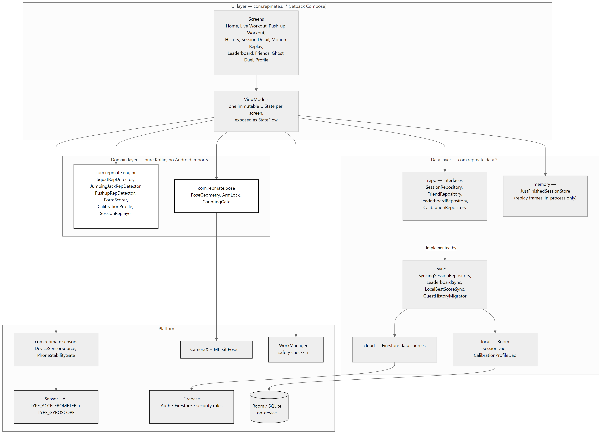
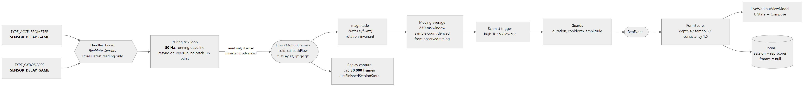
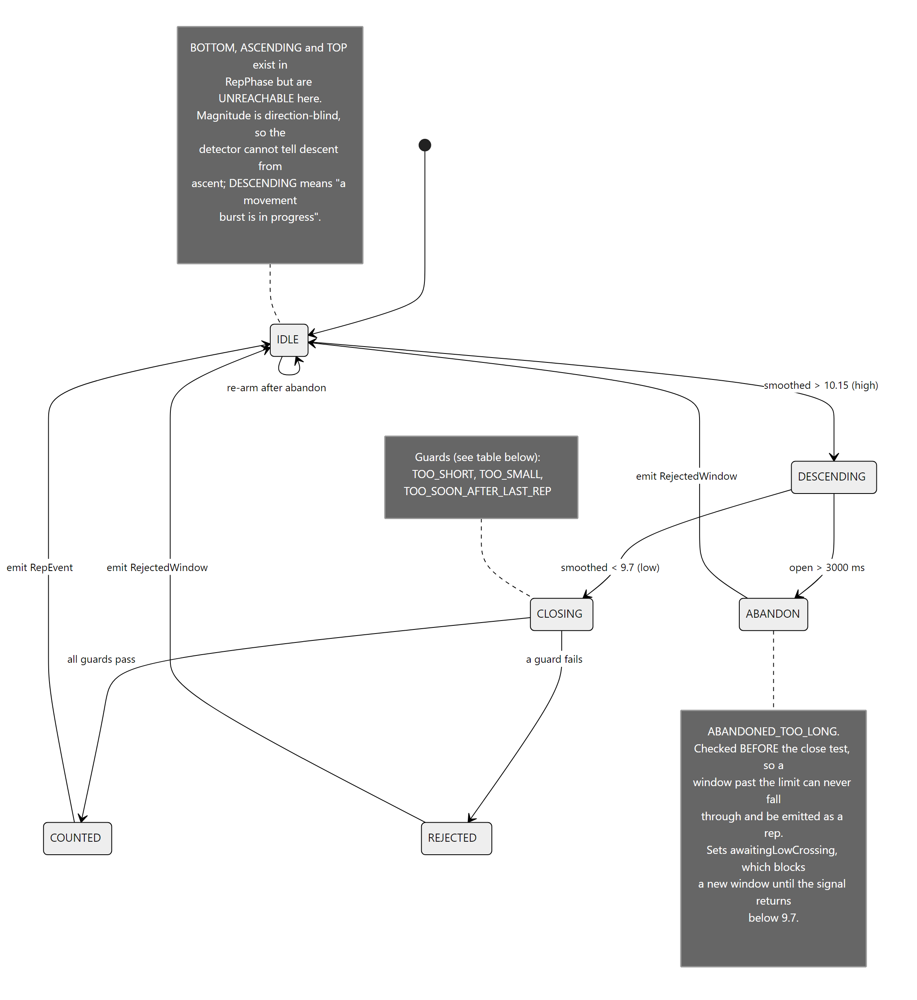
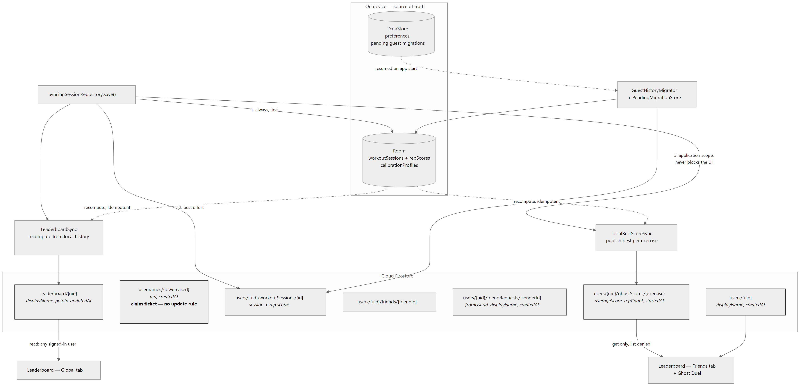
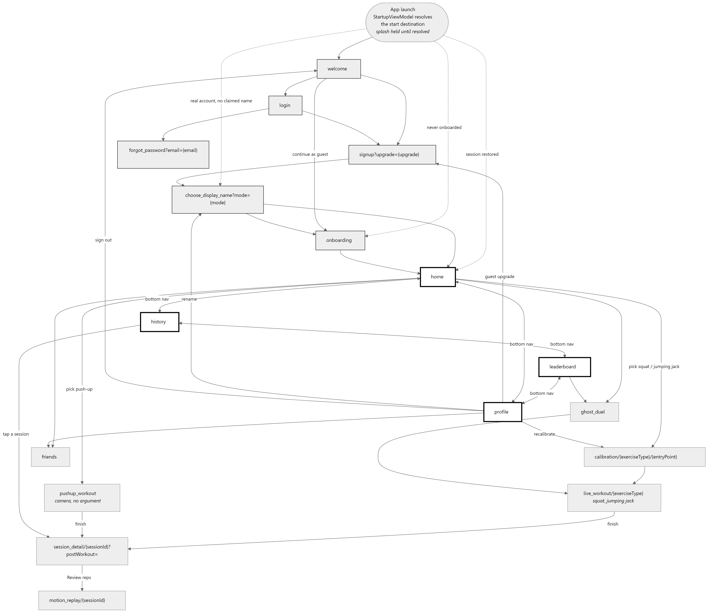
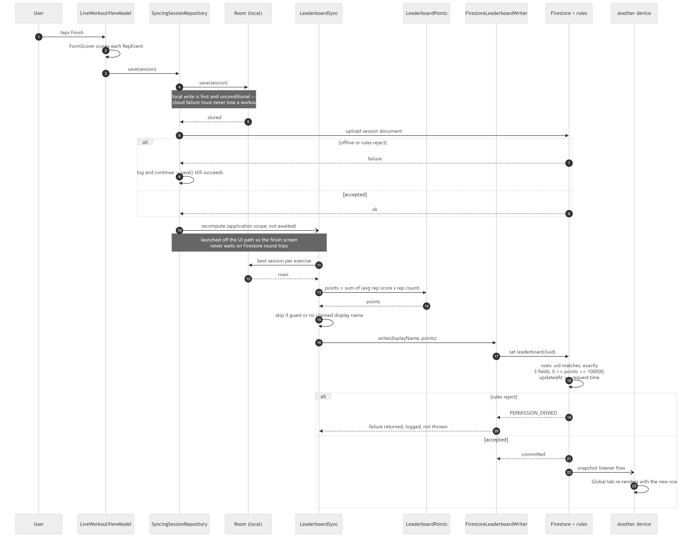

# Cover page

**Subject:** COMP90018 Mobile Computing Systems Programming
**Assignment:** Assignment 2 — Group Project
**Group number:** [FILL: group #]
**Application:** RepMate — a motion-sensing exercise form coach
**Repository:** `qichongchen/RepMate-COMP90018`, submitted at commit `530d6c1`

| Name | Student number | Email | GitHub handle |
| --- | --- | --- | --- |
| Mohit Nanda | [FILL] | [FILL] | `mohitnanda786` |
| Xue Li (Claire) | [FILL] | [FILL] | `Claire-59` |
| Xiaonuo Jia (Lisa) | [FILL] | [FILL] | `Lisa-Jia07` |
| Henrico Leodra | [FILL] | [FILL] | `henricoleodra` |
| Qichong Chen (Jasper) | [FILL] | [FILL] | `qichongchen` |

> **Publicity authorisation — decide before submitting.** The brief invites the following
> statement. It is included here so the group can consciously keep or delete it; it is not yet
> agreed.
>
> *"We authorise the University of Melbourne to use material from our submission for publicity."*

\newpage

# 1. Demo video

**Link:** [FILL: YouTube link]

The index below is built from the implemented feature set, so the video can be shot against it
and every rubric criterion has a moment a marker can jump to. Timestamps are `[FILL]` until the
video is cut.

| # | Segment | Rubric criterion it evidences | Timestamp |
| --- | --- | --- | --- |
| 1 | App launch, sign in with Google, display-name claim | Connectivity | [FILL] |
| 2 | Onboarding and the exercise tutorial dialog | UI — Flow, UI — Language | [FILL] |
| 3 | Squat calibration: five prompted reps, profile derived | Sensors, Technical depth | [FILL] |
| 4 | Live squat workout: counter, haptic buzz, spoken count | Sensors, Responsiveness | [FILL] |
| 5 | Deliberate wobble that is **not** counted | Sensors (false-positive rejection) | [FILL] |
| 6 | Jumping jacks with the metronome | Sensors, Innovation — Novelty | [FILL] |
| 7 | Camera push-up set: pose overlay, stability gate | Technical depth, Innovation — Tech Knowledge | [FILL] |
| 8 | Post-workout summary: per-rep scores and reasons | Technical depth, UI — Language | [FILL] |
| 9 | Motion Replay: smoothed curve against calibration band | Innovation — Surprise | [FILL] |
| 10 | History, score-trend chart with depth line | UI — Appeal, UI — Reactiveness | [FILL] |
| 11 | **Aeroplane mode**: finish a workout, show it saved | Connectivity (offline-first) | [FILL] |
| 12 | Reconnect, show the leaderboard row appear | Connectivity (reconciliation) | [FILL] |
| 13 | Friend request sent, accepted on a second device | Connectivity (real-time listeners) | [FILL] |
| 14 | Ghost duel against a friend's best set | Innovation — Novelty, Impact | [FILL] |
| 15 | Safety check-in: notification, then escalation SMS | Innovation — Impact | [FILL] |
| 16 | Dark/light theme toggle, TalkBack on one screen | UI — Guidelines | [FILL] |

> [!GAP] Segment 16's TalkBack demonstration has not been rehearsed, and no TalkBack pass has
> been done on the app (see §5.7). Either rehearse it or drop the segment — do not film a
> screen reader session cold.

\newpage

# 2. Build and run instructions

Written for a marker starting from a clean machine. Every version below is taken from the
build files, not from memory.

## 2.1 Prerequisites

| Requirement | Version | Where it is pinned |
| --- | --- | --- |
| JDK | **17** | `app/build.gradle.kts` → `compileOptions`; CI uses Temurin 17 |
| Android Gradle Plugin | 9.3.2 | `gradle/libs.versions.toml` |
| Gradle | 9.5.0 | `gradle/wrapper/gradle-wrapper.properties` (wrapper supplied — do not install Gradle) |
| Kotlin | 2.2.10 | `gradle/libs.versions.toml` |
| Android SDK | **compileSdk 37**, `targetSdk 37`, **`minSdk 26`** (Android 8.0) | `app/build.gradle.kts` |
| Android Studio | any release bundling AGP 9.3.x support | — |
| Node.js | 20+ | only needed for the Firestore rules tests |

## 2.2 One required secret

`app/google-services.json` **is committed to the repository**, so no Firebase file needs to be
supplied. One value is not committed:

```bash
# in the repository root, create or edit local.properties
echo "GOOGLE_WEB_CLIENT_ID=<OAuth Web client ID, client_type 3>" >> local.properties
```

The value is the `client_id` with `"client_type": 3` inside `app/google-services.json`. The
build **fails with an explicit message** if it is missing, rather than silently substituting a
placeholder that would break Google Sign-In at runtime:

```
Missing GOOGLE_WEB_CLIENT_ID in local.properties.
Copy the OAuth Web Client ID (client_type 3) from app/google-services.json.
```

`local.properties` is git-ignored, which is why this step exists.

## 2.3 Build

```bash
git clone https://github.com/qichongchen/RepMate-COMP90018.git
cd RepMate-COMP90018
# add GOOGLE_WEB_CLIENT_ID to local.properties as above
./gradlew assembleDebug          # Windows: gradlew.bat assembleDebug
```

The APK lands at `app/build/outputs/apk/debug/app-debug.apk`.

## 2.4 Run

**On a physical device (recommended — this is a motion sensor app).** Enable developer options
and USB debugging, connect, then:

```bash
./gradlew installDebug
# or, if Gradle cannot see the device (e.g. wireless debugging):
adb install -r app/build/outputs/apk/debug/app-debug.apk
```

**On an emulator.** Everything except the accelerometer exercises works. Squats and jumping
jacks depend on real device motion that the emulator's virtual sensors cannot reproduce
usefully; push-ups need a camera, which the emulator can map to a webcam. Use a Pixel system
image at API 34 or above.

**Permissions requested on first use** — each is requested at the point of use, not at launch:

| Permission | Requested when | Consequence of refusing |
| --- | --- | --- |
| `CAMERA` | starting a push-up workout | push-ups unavailable; squats and jumping jacks unaffected |
| `POST_NOTIFICATIONS` | enabling safety check-in | check-in reminders do not appear |
| `SEND_SMS` | enabling safety check-in | escalation SMS cannot be sent |
| `ACCESS_FINE_LOCATION` | enabling safety check-in | escalation SMS omits the map link |

No permission is required to count squats or jumping jacks: the accelerometer and gyroscope are
not protected permissions on Android.

## 2.5 Run the tests

```bash
./gradlew testDebugUnitTest             # 426 JVM unit tests, no device needed
./gradlew compileDebugAndroidTestKotlin # compiles the instrumented suite
./gradlew connectedDebugAndroidTest     # 47 instrumented tests; needs a device AND the emulators
npx firebase emulators:exec --only firestore "node --test tests/firestore.rules.test.cjs"
```

The instrumented suite additionally needs the Firebase emulators reachable from the device and
disposable test credentials in `local.properties` (`TEST_ACCOUNT_A_EMAIL`, `..._PASSWORD`,
`TEST_ACCOUNT_B_EMAIL`, `..._PASSWORD`, `TEST_ACCOUNT_B_UID`). On a physical device the emulator
ports must be reversed: `adb reverse tcp:8080 tcp:8080 && adb reverse tcp:9099 tcp:9099`.
Markers short of time should run the first and last commands, which need no device at all.

\newpage

# 3. Compilation screenshot

[INSERT: Android Studio console screenshot showing successful build]

Produce it with a clean build, so the console shows the whole task graph rather than a wall of
`UP-TO-DATE`:

```bash
./gradlew clean
./gradlew assembleDebug testDebugUnitTest --console=plain
```

Screenshot the Android Studio **Build** tool window showing `BUILD SUCCESSFUL`, with the test
task included so the 426 passing unit tests are visible in the same frame.

\newpage

# 4. Itemised contributions

> **Every row is `[CONFIRM]`.** The components, key files and commit counts below are derived
> mechanically from `git log main` with `.mailmap` applied — they describe *where commits
> landed*, which is not the same as who contributed what. Pair work, reviews, design, physical
> device testing and the demo video are invisible to this method. Each member must confirm or
> correct their own row before submission.

Totals: **269 commits** on `main`, 2026-08-25 to 2026-10-09, five contributors.

| Member | Components owned | Key files (by commits touching them) | Commits | Notes |
| :------------ | :---------------- | :------------------------------------------- | :------ | :-------------- |
| Mohit Nanda | Motion engine, calibration, trace corpus, test suite, push-up camera workout | `RepDetector` (6), `CalibrationProfile` (5), `LiveWorkoutViewModel` (7), `PushupWorkoutViewModel` (5) | 77 | `[CONFIRM]` Heaviest in JVM tests (59 commits touching `app/src/test`) and `engine` (24) |
| Henrico Leodra | Navigation, authentication UI, Home, Profile, charts | `NavGraph` (22), `ProfileScreen` (11), `AuthViewModel` (8), `HomeScreen` (6), `SignUpScreen` (6) | 67 | `[CONFIRM]` Largest UI footprint by a wide margin (164 touches under `ui/`) |
| Qichong Chen (Jasper) | Friends, leaderboard read path, build and manifest configuration | `FriendsScreen` (6), `LeaderboardViewModel` (4), `FriendsViewModel` (3), `FirestoreFriendRepository` (3) | 46 | `[CONFIRM]` Also 21 touches to `res/` and the manifest, 17 to build files |
| Xiaonuo Jia (Lisa) | Room persistence, Firestore workout sync, DI modules, schema migrations | `RoomSessionRepository` (8), `SyncingSessionRepository` (7), `SessionDao` (5), `RepMateDatabase` (5) | 46 | `[CONFIRM]` Almost entirely data layer: 59 touches under `data/` |
| Xue Li (Claire) | Form scoring, session detail and motion replay presentation | `FormScorer` (4), `SessionDetailScreen` (2), `MotionReplayUiModels` (2), `PushupRepDetector` (1) | 33 | `[CONFIRM]` Spread across `engine` (7), `ui` (10) and JVM tests (9) |

**Reading the commit counts fairly.** Commit counts reward granular committers and penalise
people who squash. They are reported because they are objective, not because they measure
effort. "Components owned" is the column that matters, and the one each member should check
hardest.

\newpage

# 5. Rubric justification

Diagrams referenced here are in **Appendix A**, placed after §6 so the figures do not consume
the ten pages allowed for this section.

## 5.1 Implementation — Quality (10)

**What we built.** One Gradle module whose packages form a strict dependency order, with the
domain layer kept free of the Android framework entirely.

**Where it lives.** See Figure 1. `com.repmate.engine` and `com.repmate.pose` contain **no
Android imports** — detectors, the form scorer, calibration derivation, replay and the push-up
joint geometry are all plain Kotlin. That is not decoration: it is why 426 of our tests run on
the JVM in seconds, with no device, no emulator and no Robolectric.

Separation of concerns is enforced by interfaces, not convention. `SessionRepository`,
`FriendRepository`, `LeaderboardRepository` and `CalibrationRepository` are declared in
`data/repo/` and implemented in `data/local/`, `data/cloud/` and `data/sync/`. Narrow seams
exist specifically so logic is testable without Firebase: `WorkoutUploader` (14 lines),
`LeaderboardWriter`, `BestScorePublisher` and `MigrationUploader` each exist so a fake can be
substituted. Hilt supplies the wiring (`di/RepositoryModule`, `di/SensorModule`,
`di/SafetyModule`, `di/GuestMigrationModule`).

Every screen follows the same shape — one immutable `*UiState`, exposed as a `StateFlow`, with
events returned as lambdas. Several are split stateful/stateless
(`LeaderboardScreen`/`LeaderboardContent`, `FriendsScreen`/`FriendsContent`,
`LiveWorkoutContent`) so the stateless half is both previewable and unit-testable.

**Error handling** is deliberate rather than defensive. The pattern used throughout is an
**honest sentinel instead of a plausible lie**: `SessionReplayer.replay()` returns `null` when a
session has no stored frames rather than throwing; `FormScorer` sets
`rangePercent = NOT_MEASURABLE_RANGE_PERCENT` and the reason
`"not calibrated: depth not scored"` for an uncalibrated user rather than scoring depth against
a placeholder; `DeviceSensorSource` completes an empty stream on a device with no accelerometer
rather than crashing or fabricating readings. Constructor `require` blocks reject impossible
configurations where they are built — `maxRepDurationMs` must exceed `minRepDurationMs`,
`lowThreshold` must sit below `highThreshold`.

**Why this meets the criterion.** The boundaries are checkable rather than asserted: a reviewer
can confirm the domain layer's purity by searching it for `import android.` and finding nothing.

> [!GAP] Two namespaces coexist — `com.example.repmate` (holding `MainActivity`,
> `RepMateApplication`, the Room database and auth) and `com.repmate` (everything else). The
> `applicationId` is still `com.example.repmate`. This is legacy from the project skeleton. We
> judged a rename too risky this close to submission for no functional gain, but it is a real
> inconsistency and we are not hiding it.

## 5.2 Implementation — Sensors (10)

**Which sensors, and why each is necessary.**

| Sensor | Used for | Why this one |
| --- | --- | --- |
| `TYPE_ACCELEROMETER` | squat and jumping-jack rep detection | carries the whole rep signal; works in a pocket |
| `TYPE_GYROSCOPE` | phone-stability gating for camera workouts | rotation is what moves the camera's view |
| Camera + ML Kit Pose | push-up elbow angle | push-ups barely move the torso — an IMU in a pocket cannot see them |
| Fused location | map link in the safety escalation SMS | — |

**Two decisions carry the marks here.**

*Gravity is deliberately retained.* We register `TYPE_ACCELEROMETER`, not
`TYPE_LINEAR_ACCELERATION`. Detection runs on the magnitude of acceleration, which is
**rotation-invariant** — it reads the same whatever angle the phone sits at in a pocket, a
property no single axis has. With gravity included, a still phone parks that magnitude at a
known ~9.81 m/s², so every threshold is an absolute level around a fixed baseline. Strip gravity
out and the resting value becomes ~0, putting every tuned threshold out by 9.81.

*The smoothing filter is specified in milliseconds, not samples.* This is the most consequential
decision in the sensor layer. The filter began life as "25 samples", which is 250 ms only at
100 Hz. The same 25 samples measured **250 ms** on two ~99 Hz Pixel recordings, **430 ms** on a
~58 Hz Samsung recording and **500 ms** at 50 Hz. A moving average's cutoff frequency is set by
its length *in time*, so a sample count silently re-tuned the filter on every device — and with
it every threshold downstream, because all of them are measured on the filter's output. Three
separate threshold hunts turned out to be this one bug wearing different hats. The window is now
declared as 250 ms and the sample count derived from observed frame timing on every frame, by
evicting whatever has aged out of the trailing window.

**Lifecycle.** `DeviceSensorSource.frames` is a cold `callbackFlow`: collecting it registers the
listeners and `awaitClose { stop() }` unregisters them when the collector cancels, including
when the ViewModel scope dies. A listener left registered keeps the sensor powered for the life
of the process, so tying registration to collection is what makes that impossible. Callbacks are
delivered to a dedicated `HandlerThread("RepMate-Sensors")`, keeping ~100 callbacks a second off
the main looper. Timestamps come from `SensorEvent.timestamp` (the monotonic boot clock), never
`System.currentTimeMillis()`, which can step backwards mid-workout and give a rep a negative
duration.

**Noise rejection** (Figure 3) is a Schmitt trigger plus four guards, each of which rejects a
specific false positive seen in real recordings — a wobble, a rebound, a phone-into-pocket
burst, and a state machine stuck open for 36.9 seconds because a parked phone reads 9.81, which
sits *between* the two thresholds. Rejections are reported structurally: `RejectedWindow` carries
**every** guard a window failed, with measured value against limit, so a missed rep can be traced
to the threshold that dropped it and to how far over it was.

**Degradation.** No gyroscope: the gyro channels stay zero and rep detection continues, because
it is accelerometer-driven. No accelerometer: an empty stream, which the screen reports.

> [!GAP] **Battery is handled by unregistration alone.** Nothing lowers the sample rate, batches
> events, or backs off when the screen is off, and no drain measurement was taken.
>
> [!GAP] **`StabilityConfig`'s thresholds are not measured.** The code says so itself: *"These
> defaults are a first proposal, not measured values."* They come from typical sensor-noise
> figures, not from a recording of a phone propped beside someone doing push-ups, which is the
> number that matters.

## 5.3 Implementation — Connectivity (12)

The highest-weighted criterion, and the one with the most to show.

### Authentication

Firebase Auth with three paths: Google (via Credential Manager), email/password, and **anonymous
guest**. Guests are first-class — a user can complete workouts before ever creating an account —
and the guest-to-account path is a credential **link** rather than a new account.

### Data model

See Figure 4 for collections and their shapes. Seven collections, each with its own rule block
in `firestore.rules` (230 lines).

### Security rules — the part worth reading

The rules do real work rather than restating `request.auth != null`:

- **Unique display names without a uniqueness query.** `usernames/{name}` is a *claim ticket*
  whose document id is the name lowercased. A second claim is a create on an existing document,
  and **there is no `update` rule at all**, so it is refused. That is the uniqueness guarantee —
  no query, no race.
- **Cross-document invariants.** The claim rule uses `getAfter()` to assert that the user's
  profile `displayName` *after the write* lowercases to the claimed id, forcing the claim and
  the profile change into one batch. The rename rule additionally refuses to leave a user holding
  their old claim, so a rename cannot hoard names.
- **Field allow-lists.** Every writable document is pinned with `.keys().hasOnly([...])` *and*
  `.hasAll([...])`, so neither an extra field nor a missing one is accepted. `leaderboard` also
  requires `points is int`, `0 <= points <= 100000` and `updatedAt == request.time`, so a
  modified client cannot write itself to the top or forge a timestamp.
- **Enumeration is denied.** `usernames` and `ghostScores` are `allow get` but **`allow list: if
  false`** — readable one document at a time, never enumerable. That is why the Friends
  leaderboard reads `ghostScores` per friend, and why the Global leaderboard needed its own
  collection.
- **Guests are excluded by provider**, not by naming convention: `isRealAccount()` checks
  `request.auth.token.firebase.sign_in_provider != 'anonymous'`.
- **Name validation is ASCII-only on purpose.** If `lower()` were Unicode-aware, a look-alike
  such as the Kelvin sign (U+212A, which lowercases to "k") could map onto an id someone else
  owns.

These rules are **tested**: 68 cases in `tests/firestore.rules.test.cjs`, run against the
Firestore emulator, and run **in CI on every pull request** — not merely deployed and hoped over.

### Offline-first behaviour

**Room is the source of truth.** `SyncingSessionRepository.save()` writes Room first and
unconditionally, then attempts Firestore; a cloud failure is logged and the workout still
completes. Nothing a user does is lost to a dropped connection.

**Reconciliation is by recompute, not a retry queue** (Figure 6). `LeaderboardSync` and
`LocalBestScoreSync` recompute the best session per exercise *from Room* and republish. This is
idempotent — a workout finished offline is included next time either runs, and running twice
writes the same number — so it needs no durable outbox, no retry bookkeeping and no dead-letter
handling. Both run from two places: after a workout saves, and after History restores from the
cloud.

**Conflict handling.** Ghost scores use a **Firestore transaction**, so a lower score cannot
overwrite a higher one when two devices race. Everything else is last-write-wins over idempotent
recomputation, which is safe precisely because the written value is a pure function of local
history rather than a delta.

**Interrupted guest migration resumes.** Merging a guest's history into a real account can be cut
short by a crash, a kill or a lost connection. `PendingMigrationStore` keeps a set of pending
migrations keyed by guest UID in DataStore, and `GuestMigrationLauncher.resumeOnAppStart()` walks
the queue on every launch, a no-op when it is empty.

**Real-time listeners.** Friend requests, the friends list and both leaderboard tabs are
Firestore snapshot listeners, so a request accepted on one device appears on the other without a
refresh.

> [!GAP] **Firestore offline persistence is never explicitly configured.** It works because the
> Android SDK enables the disk cache by default. We rely on a default we never stated.
>
> [!GAP] **The app never tells the user it is offline.** There is no `ConnectivityManager` or
> `NetworkCallback` anywhere in the codebase. Work is preserved correctly, but silently — a user
> with no connection sees no banner and no pending indicator.

## 5.4 Implementation — Responsiveness (6)

**What is off the main thread.** Sensor callbacks are delivered to a dedicated `HandlerThread`.
Camera frames are analysed on `Executors.newSingleThreadExecutor()` with CameraX's
`STRATEGY_KEEP_ONLY_LATEST` — real back-pressure, where a frame arriving while the previous one
is still being analysed is dropped rather than queued, so the pose pipeline cannot build a
backlog. Post-workout Firestore writes are launched in an injected `@ApplicationScope`
(`SupervisorJob + Dispatchers.IO`) explicitly so the finish screen does not wait on up to three
network round trips. Room and DataStore suspend functions dispatch internally.

**Back-pressure on the sensor stream** is handled at the source rather than with an operator. The
tick loop keeps a running deadline instead of `delay(20)` in a loop, which accumulates drift, and
when it falls behind it **resyncs to now rather than sprinting to catch up**, because a burst of
back-to-back frames would be a worse lie than a missing one. A frame is emitted only when the
accelerometer timestamp has actually advanced, so a stream running slower than the tick never
re-emits a stale reading as new motion.

**A long set cannot exhaust memory:** replay capture stops at `MAX_REPLAY_FRAMES = 30,000` (ten
minutes at the sample rate) rather than growing without bound, and stops capturing rather than
dropping the oldest frames, so what is kept is a true prefix of the set.

> [!GAP] **The IMU detector runs on the main thread.** `LiveWorkoutViewModel` collects
> `sensorSource.frames` in `viewModelScope`, which is `Dispatchers.Main.immediate`, and because
> `callbackFlow`'s producer inherits the collector's context, both the 50 Hz tick loop and every
> `detector.process()` call run there. Per-frame cost is O(1) — a circular-buffer push, an
> eviction and a handful of comparisons — and we have observed no dropped frames or jank on a
> Pixel 10a. But there is no `flowOn`, no `buffer` and no `conflate` on that path, so this is a
> property we have *observed*, not one the code *guarantees*.
>
> [!GAP] **No latency or frame-rate figure has been measured.** Nothing in the code, the tests or
> the documentation quotes a number for per-frame processing cost or end-to-end rep-to-pixel
> latency. The claims above are structural, not empirical.

## 5.5 Implementation — Technical depth (6)

**Three detectors, three different signal problems.**

*Squats* (Figure 3) run on smoothed accelerometer magnitude through a Schmitt trigger. The
hysteresis gap between 10.15 and 9.7 is what stops a signal hovering at one value from rattling
the state machine. Every guard figure is derived from measured data rather than chosen for
roundness: `minRepDurationMs` of 550 ms sits 65 ms below the shortest real rep in the corpus
(615 ms); `maxRepDurationMs` of 3000 ms is near twice the longest (1573 ms); `cooldownMs` of
500 ms leaves headroom above the tightest genuine gap (917 ms).

*Jumping jacks* are not one burst but **two impacts per rep** — the jump out and the landing — so
`JumpingJackRepDetector` pairs bursts rather than counting them, at a paced `TARGET_BPM = 52`.
The metronome reads that same constant, so audio, the visual pulse and the detector cannot drift
apart: they are one number, not three copies of it.

*Push-ups* run on elbow angle from ML Kit pose, filtered with a **median, not a mean**. A single
mislabelled landmark is removed outright by a median; a mean only attenuates it, and one frame at
40° would still drag 168° down to 104° and count a phantom rep.

**Calibration is derived, not guessed.** Across four recorded participants, squat amplitude spans
**7.1×** between the softest and the strongest while both squat correctly, so a single global
threshold is set by whoever squats softest. `CalibrationProfile` derives four per-user thresholds
from a five-rep set, and each margin is justified against measured drift between the first and
last five reps of recorded sets — `AMPLITUDE_MARGIN` 0.65 against a worst observed softening of
0.771; `MAX_DURATION_MARGIN` 2.2 as the geometric centre of a band bounded below by 1.214 and
above by 4.03.

**Replay determinism.** `SessionReplayer` re-runs a session's stored raw frames through the same
detector and scorer used live. It is deterministic because the moving average is **causal** — it
never looks at future samples, so it behaves identically live and in replay — the detectors are
pure and read no clock, and the same `CalibrationProfile` is passed back in. What would break it,
stated explicitly: changing `smoothingWindowMs` or any threshold; frames arriving out of
chronological order; a non-monotonic timestamp source; or replaying under a different profile.

**Honest sentinels over plausible numbers.** `RepScore.pauseSeconds` is always `0f` and
documented as a placeholder. Because magnitude is direction-blind, the detector cannot
distinguish descent from ascent, so no timestamp exists for "reached the bottom" and there is
nothing to measure a dwell against. We report zero and say why rather than inventing a figure.

> [!GAP] **The strongest thresholds rest on thin evidence, and the code says so.** `minAmplitude`
> separates wobbles from reps unaided, on a band 0.15 m/s² wide, **both edges of which come from a
> single participant**. The jumping-jack defaults come from two recordings of one person on one
> phone. The push-up thresholds come from one person, one session, one camera placement. More
> participants would either widen these bands into something defensible or show that no fixed
> threshold generalises — and that second answer argues for per-user calibration everywhere, which
> is why squats and jumping jacks already have it.

## 5.6 UI — Appeal (4)

A single deliberate visual identity: charcoal `#121212` with an acid-lime `#C6F135` accent,
applied through one Material 3 `ColorScheme` and one `Typography`. Three shared components —
`RepMateCard`, `RepMateButton` (variants `Solid` and `Ghost`) and `RepMateTopBar` — give every
screen the same card radius, border and header treatment.

Charcoal rather than pure black is considered, not accidental: pure black crushes contrast on
OLED and reads harshly next to a bright accent. Dynamic (wallpaper-derived) colour is
**deliberately not enabled**, because it would replace the lime accent with a device-specific
colour and dissolve the identity the palette exists to create.

`RepMateTopBar` was extracted from two private, identical copies in `GhostDuelScreen` and
`SessionDetailScreen`, so a fourth screen cannot quietly drift from the other three.

## 5.7 UI — Guidelines (6)

**Material Design 3.** `MaterialTheme` with `darkColorScheme`/`lightColorScheme`, custom
`Typography` and `Shapes`; stock M3 `NavigationBar`, `Switch`, `Snackbar`, `AlertDialog`, `Icon`
and `IconButton`. The one screen that had drifted onto Material defaults — Friends, which used
`Scaffold`/`TopAppBar` and referenced colour roles our theme does not define, so it rendered in
baseline Material purple — was rebuilt on the shared components in commit `00cb8f3`.

**Android accessibility guidelines, specifically:**

- *Provide content labels.* 36 `contentDescription`s, and — equally important — **19 explicitly
  set to `null`** on decorative icons, which is what the guideline actually asks for: a screen
  reader should not announce an ornament.
- *Announce the right role.* Interactive elements declare semantics rather than relying on a bare
  `clickable`: `Role.Button`, `Role.Tab` (leaderboard tabs, so TalkBack says which is selected),
  `Role.Switch` and `Role.Checkbox`, with `onClickLabel` on clickables.
- *Support text scaling.* All 25 type sizes are declared in `sp`, with **no font size anywhere
  declared in `dp`**, so system font scaling works.
- *Do not rely on colour alone.* The current user's leaderboard row carries the text "you" as well
  as a tint; a history session that recorded no reps shows "–" rather than a colour change.
- *Respect the user's theme.* Dark mode is an in-app preference backed by DataStore, with
  `LocalRepMateDarkTheme` so resource-picking composables stay consistent with it.

> [!GAP] **Touch targets are large by layout, not by constraint.** Only five places in the UI set
> an explicit minimum size and nothing calls `minimumInteractiveComponentSize()`. We believe all
> targets meet 48 dp but have not verified it.
>
> [!GAP] **No contrast ratios have been computed** and **no TalkBack pass has been performed.**
> Roles and labels are declared; nobody has navigated a screen with a screen reader to confirm the
> result is usable. Declaring semantics is necessary but not sufficient, and we should not claim
> an accessibility result we have not observed.
>
> [!GAP] **The light theme has never been run on a device** — it exists and is exercised by
> Compose previews only.

## 5.8 UI — Flow (6)

Eighteen destinations (Figure 5). Three decisions are worth defending:

**Launch routing lives in exactly one function.** `RepMateDestinations.afterAuth()` decides where
a signed-in user lands — display-name gate, onboarding or Home — and is called both after an
interactive sign-in and at launch for a restored session. One rule, one implementation, so the two
paths cannot disagree. The system splash is held until `StartupViewModel` has resolved the
destination, so a returning user never sees Welcome flash before Home.

**Calibration sits on the path into a workout, not in a settings screen.** Choosing squats on Home
routes through `calibration/{exerciseType}/{entryPoint}`, carrying an entry point so the same
screen knows whether it was reached as a first-time gate or as a deliberate recalibration from
Profile.

**One screen, two modes, via an optional query parameter.** `session_detail/{id}?postWorkout=` is
the post-workout summary when reached from a finished workout and plain detail when reached from
History. The parameter is omitted when false, so History's route is byte-identical to what it
always was.

## 5.9 UI — Language (4)

Feedback is phrased as observation, not verdict. A rep reads "good depth, slower than usual" or
"not deep enough, good tempo" — specific and actionable, assembled from the individual reasons
`FormScorer` emits rather than reduced to a bare score.

The clearest language decision is **refusing to say something we cannot know**. An uncalibrated
user is told "not calibrated: depth not scored" instead of being shown a depth score computed
against a placeholder. Given measured amplitude spans about 9× between real users, a fixed
reference would tell a strong squatter they are permanently "too deep" and a light squatter they
are permanently "not deep enough" — and someone might change an already-correct squat to chase a
misleading number. Likewise a session that recorded no reps shows "–", not "0.0", because 0.0
reads as a real and catastrophic score.

Section labels are lowercase and quiet ("your friends", "ghost duel", "score trend"); numbers
carry their units ("197 pts", "8 reps").

## 5.10 UI — Reactiveness (6)

Every screen renders from one immutable `UiState` exposed as a `StateFlow` and collected with
`collectAsStateWithLifecycle`, so recomposition is scoped and collection stops when the screen is
not resumed. There is no mutable shared UI state and no manual invalidation.

During a live workout the rep counter, the elapsed timer and the per-rep feedback all update from
the same emission, so the number on screen, the haptic buzz and the spoken count cannot disagree.
Firestore-backed screens are driven by snapshot listeners rather than polling, so a friend request
accepted elsewhere appears without a refresh. Settings toggles write to DataStore and are read
back as flows, so the theme switch takes effect immediately across the app rather than at next
launch.

Loading and empty states are modelled explicitly in the state classes rather than inferred from a
null, so a screen with no data says so instead of rendering blank.

## 5.11 Innovation — Novelty (3)

**The ghost duel.** Rather than a leaderboard number, a user races a friend's *best recorded set* —
same exercise, their score to beat, shown live. It reuses the scoring pipeline rather than adding
a parallel one.

**Motion replay.** After a set, the user sees the actual smoothed accelerometer curve for each rep
with their calibration band drawn behind it. Most fitness apps show a count; this shows the signal
the count came from.

**A metronome as part of the detector's contract.** Jumping-jack counting *requires* a paced
cadence, so rather than hiding that assumption the app supplies the pace, and the detector and the
audio share one constant.

## 5.12 Innovation — Surprise (3)

The intended moment of surprise is Motion Replay: a user expecting a rep counter instead sees the
waveform their body produced, with their own calibrated range behind it, and can see *why* rep 7
scored lower than rep 6.

The second is the safety check-in — a fitness app that notices you have not confirmed you are all
right after a session, and escalates to a contact with your last known location.

> [!GAP] This criterion is argued rather than evidenced; no artefact in the repository
> demonstrates "surprise". It depends entirely on how the demo video stages these two moments.

## 5.13 Innovation — Tech Knowledge (4)

The techniques below are used because the problem demanded them, and each is documented at its
definition with the measurement that justified it:

- **Schmitt trigger / hysteresis** in all three detectors, so a signal hovering at a threshold is
  not counted repeatedly.
- **Rotation-invariant magnitude**, making detection independent of phone orientation.
- **Causal, time-specified moving average**, so the cutoff frequency is a property of the filter
  rather than of the device's sample rate — and so replay is identical to live.
- **Median filtering** on the pose angle, chosen over a mean because it removes outliers outright
  rather than attenuating them.
- **O(1) circular-buffer filtering** with primitive arrays and a running sum, so the hot path
  allocates nothing per frame.
- **Transactional max-write** for ghost scores, and **idempotent recompute** instead of a retry
  queue for sync.
- **Claim-ticket uniqueness** in security rules, using document-id collision rather than a query.

## 5.14 Innovation — Cross-Disciplinary (3)

The genuine cross-disciplinary content is **digital signal processing applied to a biomechanical
signal**: time-domain filter design, hysteresis, outlier-robust statistics and the
rotation-invariance argument are signal-processing results rather than software-engineering ones,
and they are what makes the counting work.

There is also a **human-factors** thread with a real engineering consequence: the finding that
squat amplitude spans roughly 9× between individuals who are all squatting correctly is why the
app calibrates per user and refuses to score depth without a profile. The design accommodates
human variation instead of asserting a norm.

> [!GAP] **There is no exercise-science or biomechanics literature behind the form model.** We
> searched the codebase to confirm this before writing. The depth, tempo and consistency weights
> (4, 3 and 1.5) are a first pass, documented in `FormScorer` as "a reasonable starting point, not
> a value agreed with the rest of the team". Scoring is *self-relative* — your reps against your
> own calibration — which is defensible engineering but is not exercise science. Claiming
> biomechanical grounding would be inventing it. Closing this properly means citing literature for
> a depth or tempo standard and re-deriving the weights from it.

## 5.15 Innovation — Impact (3)

The app addresses unsupervised exercise, where the failure mode is not laziness but doing the
movement badly without knowing. Per-rep feedback phrased as observation, calibrated to the
individual, is aimed at exactly that.

Two choices widen who can use it. **`minSdk 26`** (Android 8.0, 2017) keeps the app on old hardware
rather than only on recent flagships. **Guest mode** lets someone complete a workout and see their
scores without creating an account, and the guest-to-account path preserves their history if they
later sign up.

The **safety check-in** targets a specific risk: exercising alone. The app sends a notification
after a session and, if it is not acknowledged, escalates to a nominated contact by SMS with the
last known location. The acknowledgement flag is re-checked at send time, so an alert is not sent
to someone who confirmed they were fine while the timer was pending.

\newpage

# 6. AI tool acknowledgement

Generative AI tools were used during this project. In accordance with the assignment brief, their
use is disclosed below. A running log is also maintained in `AI_USAGE_LOG.md` in the repository
root. Every entry records what was generated, by whom and how the output was reviewed before it
entered the codebase; no output was committed without a named member reviewing it.

| Tool | Where used | Example of use | How the output was reviewed |
| --- | --- | --- | --- |
| [FILL] | [FILL] | [FILL] | [FILL] |
| [FILL] | [FILL] | [FILL] | [FILL] |
| [FILL] | [FILL] | [FILL] | [FILL] |
| [FILL] | [FILL] | [FILL] | [FILL] |
| [FILL] | [FILL] | [FILL] | [FILL] |

> [!GAP] This table is deliberately empty. Each member must complete their own rows — nobody else
> can accurately describe how a third party reviewed an AI output. Note that 30 of the
> repository's commits carry `Co-Authored-By` trailers naming an AI assistant, all dated on or
> before 2026-09-20; `git log --all --grep="Co-Authored-By"` lists them and is a useful starting
> point.

\newpage

# Appendix A — Diagrams

Placed here so the figures do not consume the page allowance for §5. Each is referenced from the
section it supports. Mermaid sources are in `report/diagrams/*.md`.

### Figure 1 — System architecture (§5.1)



\newpage

### Figure 2 — Sensor data pipeline (§5.2)



### Figure 3 — Squat rep-counting state machine (§5.2, §5.5)



\newpage

### Figure 4 — Cloud data model and sync (§5.3)



\newpage

### Figure 5 — Screen flow (§5.8)



\newpage

### Figure 6 — End-to-end sequence: workout to leaderboard (§5.3)



\newpage

# Appendix B — Test and verification summary

| Suite | Count | Status | How to reproduce |
| --- | --- | --- | --- |
| JVM unit tests | **426** | 0 failures, 0 errors, 0 skipped, 0 `@Ignore` | `./gradlew testDebugUnitTest` |
| Instrumented tests | 47 across 8 files | compile in CI; 30 verified running on a Pixel 10a | `./gradlew connectedDebugAndroidTest` |
| Firestore rules tests | 68 cases | pass against the emulator, run in CI | `npx firebase emulators:exec --only firestore "node --test tests/firestore.rules.test.cjs"` |

**Engine tests are backed by real recordings, not synthetic signals.** Six recorded traces ship as
test resources in `app/src/test/resources/traces/`, each paired with a `.expect` file holding
ground truth — how many reps the recording contains, and how many events the whole file should
produce including deliberate non-rep bursts. `TraceLibrary` discovers any new `.csv` + `.expect`
pair automatically. Raw unstripped exports are archived in `traces/raw/` as zips.

**Continuous integration** (`.github/workflows/android-ci.yml`) runs on every pull request and
every push to `main`: `assembleDebug`, then `testDebugUnitTest`, then
`compileDebugAndroidTestKotlin`, then the Firestore rules tests against the emulator on JDK 21.

The instrumented-test compile step was added after discovering that `androidTest` had silently
stopped compiling — a production method was renamed and the test file kept calling the old name. A
source set that does not compile takes **every** test in it down, so the Room, DataStore and
safety-worker tests were unrunnable too, and neither `assembleDebug` nor `testDebugUnitTest`
noticed. The gate was verified by reintroducing the breakage and confirming the step fails.

> [!GAP] **8 of the 47 instrumented tests have never been executed.**
> `FirestoreFriendRepositoryTest` was rewritten for the friend-request flow and compiles, but
> running it needs the Firestore and Auth emulators plus disposable account credentials, which we
> have not had set up at the same time as a connected device. They are not claimed as passing.
>
> [!GAP] **CI compiles the instrumented tests but does not run them.** Doing so needs an AVD in CI
> plus the emulators and credentials.

# Appendix C — Known limitations

Collected from the `[!GAP]` markers above so a marker can see them in one place. We judged it
better to state these than to write around them.

| # | Limitation | Section |
| --- | --- | --- |
| 1 | Two package namespaces coexist; `applicationId` is still `com.example.repmate` | §5.1 |
| 2 | Battery handling is unregistration only; no drain measured | §5.2 |
| 3 | `StabilityConfig` thresholds are proposed, not measured | §5.2 |
| 4 | Firestore offline persistence relies on an unstated SDK default | §5.3 |
| 5 | The app never indicates to the user that it is offline | §5.3 |
| 6 | The IMU detector runs on the main thread with no `flowOn` | §5.4 |
| 7 | No latency or frame-rate figure has been measured | §5.4 |
| 8 | Key thresholds rest on one or two participants | §5.5 |
| 9 | `RepScore.pauseSeconds` is always 0 — not derivable from magnitude | §5.5 |
| 10 | Touch targets unverified; no contrast ratios; no TalkBack pass | §5.7 |
| 11 | Light theme never run on a device | §5.7 |
| 12 | No exercise-science grounding for the form-scoring weights | §5.14 |
| 13 | 8 instrumented tests have never been executed | App. B |
