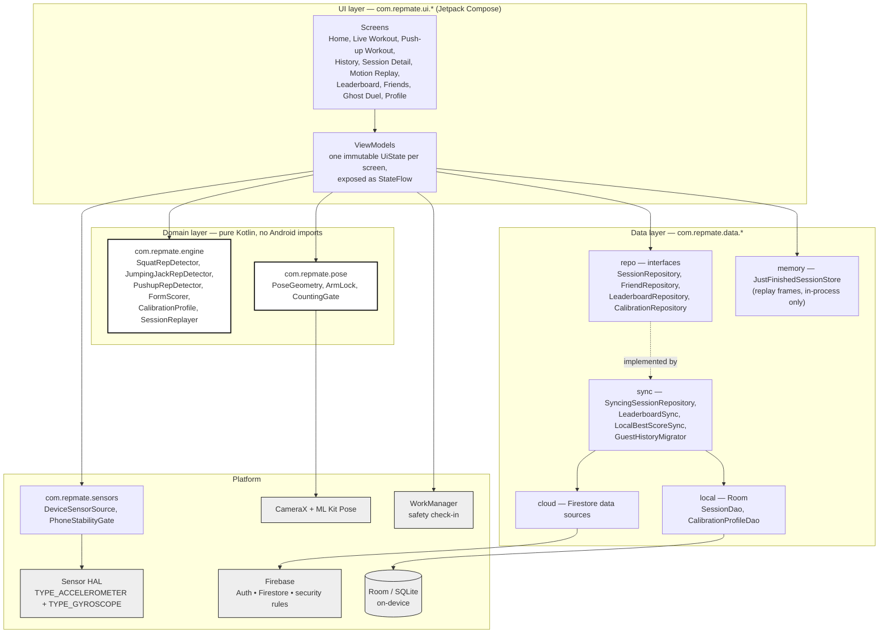

# Diagram 1 — System architecture

Layered view. Every box is annotated with the package (module boundary) it lives in.
Referenced from REPORT.md §5.1 (Implementation — Quality).

**Boundary that matters:** `com.repmate.engine` and `com.repmate.pose` contain no Android
imports at all, which is why 426 unit tests run on the JVM with no device or emulator.
Hilt wires the arrows (`di/RepositoryModule`, `di/SensorModule`, `di/SafetyModule`).
