# Diagram 2 — Sensor data pipeline

Rates and buffer sizes are those the code specifies; each is annotated with its source.
Referenced from REPORT.md §5.2 (Implementation — Sensors).

```mermaid
graph LR
  A["TYPE_ACCELEROMETER<br/><b>SENSOR_DELAY_GAME</b>"]
  G["TYPE_GYROSCOPE<br/><b>SENSOR_DELAY_GAME</b>"]
  HT{{"HandlerThread<br/><i>RepMate-Sensors</i><br/>stores latest reading only"}}
  TICK["Pairing tick loop<br/><b>50 Hz</b>, running deadline<br/>resync-on-overrun, no catch-up burst"]
  MF(["Flow&lt;MotionFrame&gt;<br/>cold, callbackFlow<br/>t, ax ay az, gx gy gz"])
  MAG["magnitude<br/>&radic;(ax&sup2;+ay&sup2;+az&sup2;)<br/>rotation-invariant"]
  SM["Moving average<br/><b>250 ms</b> window<br/>sample count derived<br/>from observed timing"]
  ST["Schmitt trigger<br/>high 10.15 / low 9.7"]
  GU["Guards<br/>duration, cooldown, amplitude"]
  RE(["RepEvent"])
  FS["FormScorer<br/>depth 4 / tempo 3 / consistency 1.5"]
  UI["LiveWorkoutViewModel<br/>UiState &rarr; Compose"]
  CAP["Replay capture<br/>cap <b>30,000 frames</b><br/>JustFinishedSessionStore"]
  DB[("Room<br/>session + rep scores<br/>frames = null")]

  A --> HT
  G --> HT
  HT --> TICK
  TICK -->|"emit only if accel<br/>timestamp advanced"| MF
  MF --> MAG --> SM --> ST --> GU --> RE
  RE --> FS --> UI
  MF --> CAP
  FS --> DB

  classDef hw fill:#eeeeee,stroke:#000;
  class A,G hw;
```

## Annotations and their source in the code

| Figure | Where | Why that value |
| --- | --- | --- |
| `SENSOR_DELAY_GAME` | `SensorSource.kt:146-157` | ~20 ms nominal, the ~50 Hz the engine is tuned for |
| 50 Hz emit rate | `DEFAULT_SAMPLE_RATE_HZ`, `SensorSource.kt` | the rate the thresholds and recorded traces assume |
| 250 ms filter | `DEFAULT_SMOOTHING_WINDOW_MS`, `RepDetector.kt` | specified in **time**, not samples, so the cutoff frequency is the same on any device |
| 10.15 / 9.7 | `RepDetector.kt` | positioned around resting gravity ~9.81 |
| 30,000 frames | `LiveWorkoutViewModel.MAX_REPLAY_FRAMES` | ten minutes at the sample rate; capture stops rather than dropping oldest |

**No queue sits between the stages.** The gyroscope value in a frame may be up to one sensor
period (<20 ms) staler than the accelerometer value, which is far below the ~1 s timescale of
a rep. Pairing is latest-value-wins because no Android callback delivers both sensors at once.
