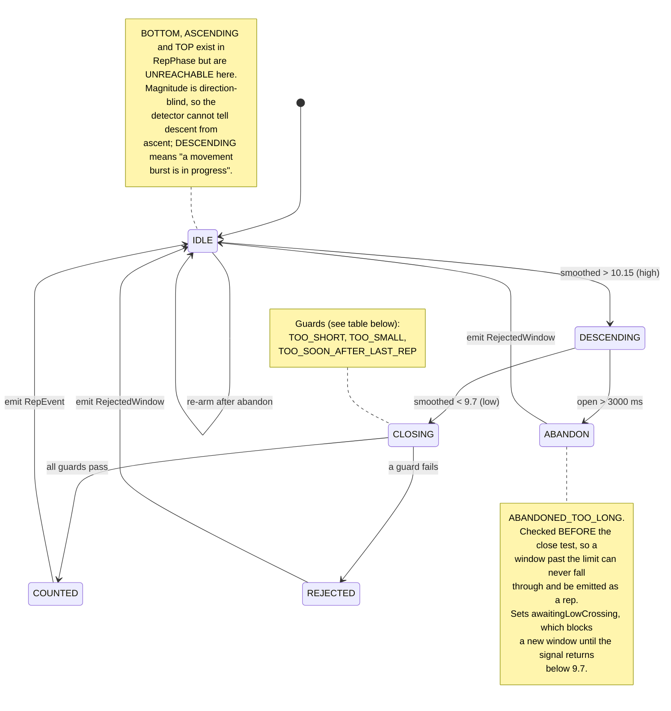

# Diagram 3 — Squat rep-counting state machine

State names and guards taken verbatim from `com.repmate.engine.SquatRepDetector` and
`RepPhase`. Rejection paths included.
Referenced from REPORT.md §5.2 and §5.5.

## The guards

Every one is measured on the **smoothed** signal, and `RejectedWindow` reports *every* guard
a window failed with measured-against-limit, not just the first.

| Guard | Condition | Default |
| --- | --- | --- |
| `TOO_SHORT` | window open < `minRepDurationMs` | 550 ms |
| `TOO_SMALL` | peak-to-peak swing < `minAmplitude` | 0.94 m/s² |
| `TOO_SOON_AFTER_LAST_REP` | start < `lastRepEndMs` + `cooldownMs` | 500 ms |
| `ABANDONED_TOO_LONG` | window open > `maxRepDurationMs` | 3000 ms |

**Why abandonment is checked mid-flight, not at close.** A phone parked still reads ~9.81,
which sits *between* `lowThreshold` (9.7) and `highThreshold` (10.15) — so a burst that ends
with the phone set down opens a window nothing ever closes. On one recorded trace that window
ran 36.9 seconds, reported as a single rep. Judging it at close time would fix the miscount
and leave the real defect: for those 36.9 s the detector is stuck in `DESCENDING` and cannot
start a rep at all — a live user would squat into a counter that had gone deaf.
