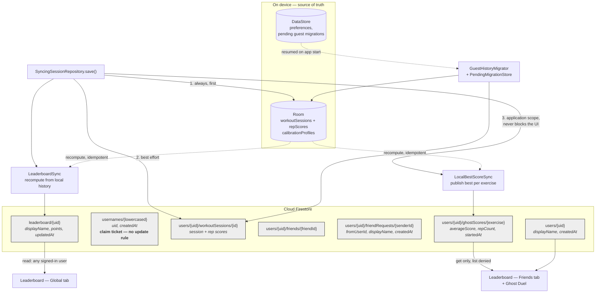

# Diagram 4 — Cloud data model and sync

Collections, who reads and writes each, and the offline&rarr;online reconciliation path.
Shapes and rules taken from `firestore.rules` and `com.repmate.data.cloud.*`.
Referenced from REPORT.md §5.3 (Implementation — Connectivity).

## Who may read and write each collection

| Collection | Read | Write | Enforcement worth noting |
| --- | --- | --- | --- |
| `users/{uid}` | any signed-in (`get`); `list` **denied** | owner only | rename must not leave the old name claimed |
| `usernames/{name}` | any signed-in (`get`); `list` **denied** | create by owner; **no `update` rule at all** | uniqueness is a document-id collision, not a query |
| `workoutSessions` | owner | owner | — |
| `friends` | owner | owner, **or** the accepter creating the reverse side | reverse side allowed only if a matching request exists |
| `friendRequests` | recipient and sender | sender creates, recipient deletes; `update` denied | — |
| `ghostScores` | any signed-in (`get`); `list` **denied** | owner | so it cannot back a global board |
| `leaderboard/{uid}` | any signed-in | owner only | `points` is an int bounded 0&ndash;100000 |

## Offline &rarr; online reconciliation

Room is written **first and unconditionally**; a Firestore failure is logged and the workout
still completes. Catch-up is by **recompute-and-republish from local history**, not by a
retry queue — `LeaderboardSync` and `LocalBestScoreSync` recompute the best session per
exercise from Room and write it again. That is idempotent, so a workout finished offline
counts exactly once when connectivity returns, and running it twice changes nothing.

Ghost scores additionally use a **Firestore transaction** so a lower score can never
overwrite a higher one in a race between devices.
