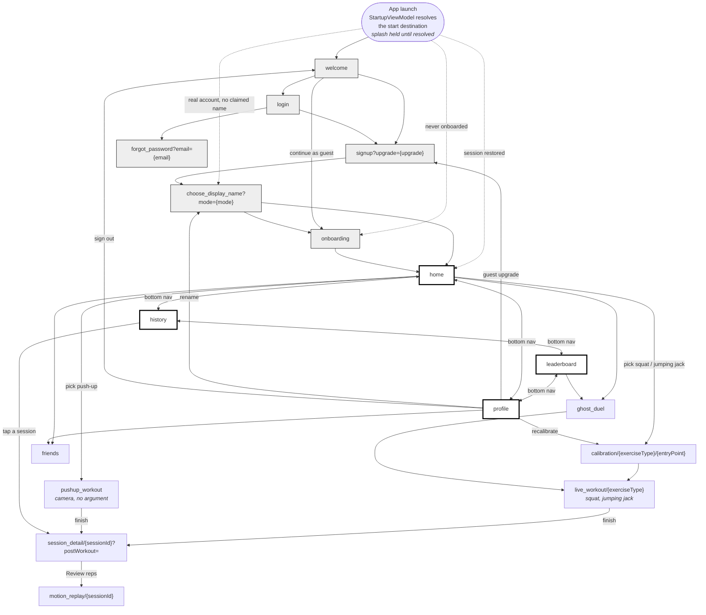

# Diagram 5 — Screen flow

Every destination registered in `RepMateDestinations` / `NavGraph.kt`, and the navigation
between them. Route patterns are given as the code declares them.
Referenced from REPORT.md §5.7 (UI — Flow).

Thick-bordered nodes are the four bottom-navigation tabs. Shaded nodes are the
pre-Home flow. Dashed edges are launch-time routing decided by `RepMateDestinations.afterAuth`,
which is the single home of that rule — used both after a sign-in and at launch for a
restored session.

Push-ups get their own route with no `{exerciseType}` argument because that screen is
push-ups only; there is nothing for an argument to select between.
