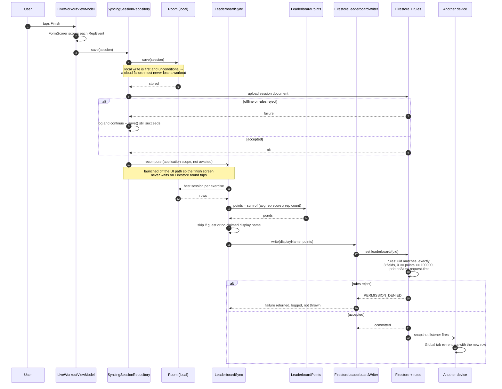

# Diagram 6 — End-to-end sequence: a finished workout reaching other devices

The leaderboard write path, from the last rep to another signed-in user's screen updating.
Referenced from REPORT.md §5.3 (Implementation — Connectivity).

**Why the recompute is not a retry queue.** `LeaderboardSync` recomputes the user's total
from whatever is in Room at the time, so it is idempotent and self-healing: a workout
finished offline is included the next time the sync runs, and running it twice writes the
same number. The same method is called from two places — after a workout saves, and after
History restores sessions from the cloud.
